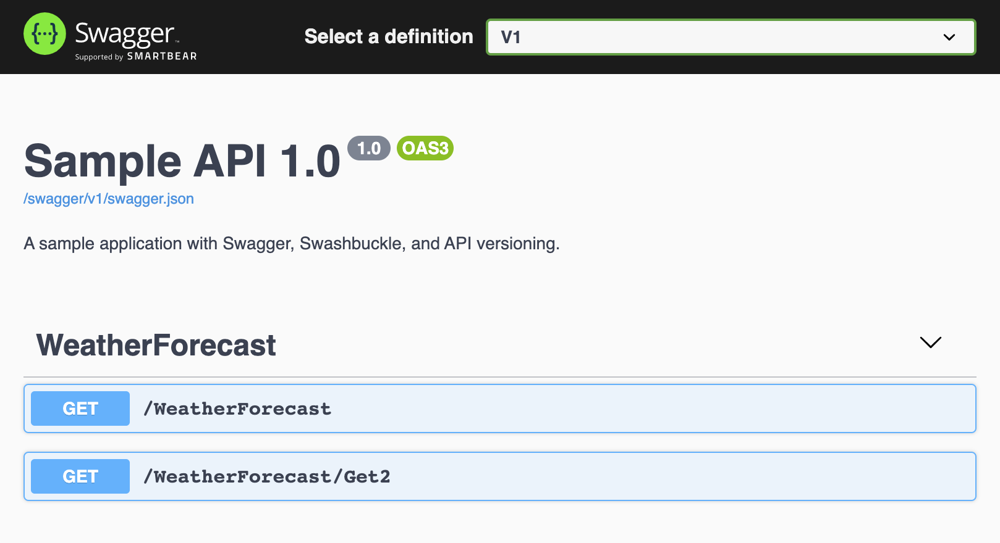
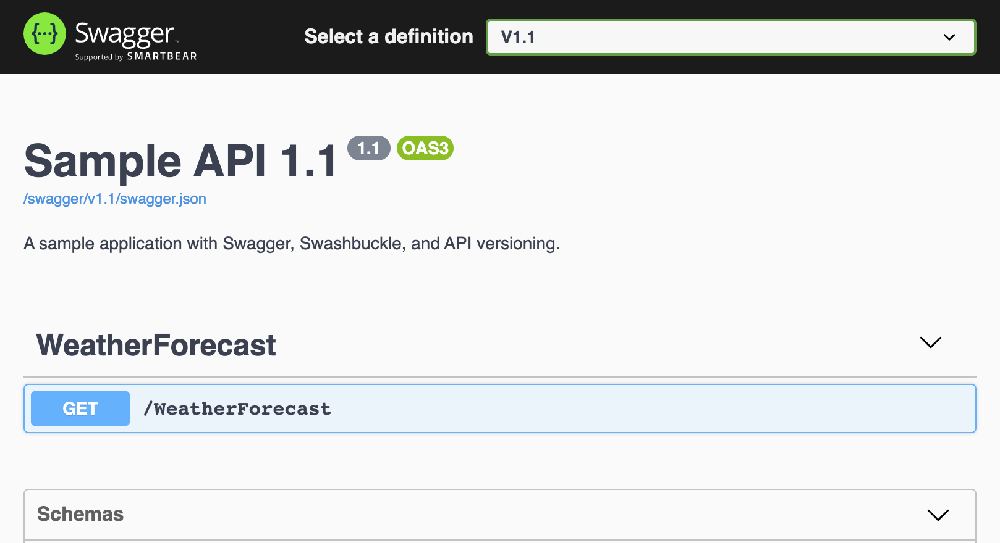

[Swagger](https://swagger.io/)는 마이크로소프트 [공식 문서](https://docs.microsoft.com/en-us/aspnet/core/tutorials/getting-started-with-swashbuckle?view=aspnetcore-3.1&tabs=visual-studio)에도 등장하는 API 문서관리 도구이다. 잘 정리된 문서는 퍼블릭 서비스(OpenAPI) 뿐만 아니라 내부 사용자에게도 큰 도움이 되기에 API를 운영한다면 반드시 도입하기를 추천한다. Swagger을 사용하기 위한 ASP.NET Core 애플리케이션의 설정은 [마이크로소프트 문서](https://docs.microsoft.com/en-us/aspnet/core/tutorials/getting-started-with-swashbuckle?view=aspnetcore-3.1&tabs=visual-studio)에서 보듯이 매우 쉽다. 이 글에서는 API를 여러 버전으로 제공할 경우의 다소 까다로운 Swagger 설정을 다룬다.

<!--more-->

## API 멀티 버전

이 글은 API가 멀티 버전을 현재 지원하거나 지원할 계획이 있을 때 유용하다. 이전 글, [API 버전관리]()를 참고하여 독자의 API에 멀티 버전을 적용하면 예시를 따라 다중 문서 시스템을 얻게될 것이다.

## API Explorer

첫번째 해결할 과제는 혼재하는 API의 버전들을 파악하는 것이다. `Microsoft.AspNetCore.Mvc.Versioning.ApiExplorer` 패키지를 설치하여 다음과 같이 구현한다.

[ConfigureServices() @Startup.cs]
```csharp
// Api Explorer를 사용할 때, 버전 포맷도 같이 지정한다. 예시는 v2.0.1 처럼 major.minor.build 포맷을 의미한다.
services.AddVersionedApiExplorer(options => { options.GroupNameFormat = “’v’VVV”; });

// 버전 지정과 관련된 옵션이다. 클라이언트에서 요청 API의 버전을 명시하지 않을때 사용할 기본버전과 어떤 방식(여기서는 헤더)으로 명시하는지 정하고 있다.
services.AddApiVersioning(config =>
{
    config.DefaultApiVersion = new ApiVersion(1, 0);
    config.AssumeDefaultVersionWhenUnspecified = true;
    config.ReportApiVersions = true;
    config.ApiVersionReader = new HeaderApiVersionReader(“X-Version”);
});

// Swagger 문서를 추가하는 중요한 설정이다.
services.AddSwaggerGen(options =>
{
    var scopeFactory = services
        .BuildServiceProvider()
        .GetRequiredService<IServiceScopeFactory>();

    using var scope = scopeFactory.CreateScope();
    var serviceProvider = scope.ServiceProvider;
    var descriptionProvider = serviceProvider.GetRequiredService<IApiVersionDescriptionProvider>();
        
    foreach (var description in descriptionProvider.ApiVersionDescriptions)
    {
        options.SwaggerDoc(description.GroupName, CreateInfoForApiVersion(description));
    }
});
```

## 문제 있는 Swagger 설정

`IApiVersionDescriptionProvider` 인터페이스가 정의하고 있는 `ApiVersionDescriptions` 속성은 API Expolorer가 찾아낸 여러 API 버전에 대한 설명의 집합이다. 이 속성은 `foreach`문에서 각 버전별 설명정보를 제공하여 Swagger 문서를 추가하는데 사용된다. 여기에는 문제가 없지만 `IApiVersionDescriptionProvider`에 해당하는 인스턴스를 얻는 과정이 문제가 된다.

서비스를 구성하는 ConfigureServices() 메서드가 실행되면야, 그 이후에는 어디서든 종속성 주입을 통해 해당 객체를 얻어낼 수 있다. 한 가지 예로, 심지어 같은 Startup.cs 파일내에서도 다음과 같이 사용하여 `IApiVersionDescriptionProvider` 인터페이스로 등록된 인스턴스를 얻어낼 수 있다.

```csharp
  public void Configure(IApplicationBuilder app, IWebHostEnvironment env,
      IApiVersionDescriptionProvider provider)
  { ... }
```

문제는 ConfigreServices() 메서드내에서는 종속성 관련해서 DI 컨테이너의 도움을 받을 수 없다는 것이다. 따라서, `services.BuildServiceProvider()` 메서드를 호출하여 명시적으로 서비스 프로바이더를 작성한 후에 `GetRequiredService<>()` 메서드를 사용해서 종속성으로 등록된 객체의 인스턴스를 얻어야 한다.

이 과정에서 컴파일러는 이런 경고를 보낸다.

> Startup.cs(68, 32): [ASP0000] Calling 'BuildServiceProvider' from application code results in an additional copy of singleton services being created. Consider alternatives such as dependency injecting services as parameters to 'Configure'.

서비스 프로바이더는 종속성을 찾아주는 하나의 싱글턴이어야 하는데 `BuildServiceProvider()` 메서드를 호출하는 바람에 추가적인 인스턴스를 만들고 있다는 경고다. 만약, 개발팀의 빌딩 파이프라인이 경고도 허용하지 않게 엄격하다면 이 경고때문에 빌드 에러가 나고 결국 소스를 머지할 수 없거나, 또는 소스는 머지했다 하더라도 배포에 문제가 생길 수 있다.

## Extesion to IServiceCollection

해결방법은 이 과정을 Startup.cs 외부로 옮겨가는 것이다. `IServiceCollection`의 익스텐션을 다음과 같이 구현한다.

```csharp
public static class SwaggerServiceExtensions
{
    public static IServiceCollection AddSwaggerDocumentation(this IServiceCollection services)
    {
        services.AddVersionedApiExplorer(options => { options.GroupNameFormat = "'v'VVV"; });

        var scopeFactory = services
            .BuildServiceProvider()
            .GetRequiredService<IServiceScopeFactory>();

        using var scope = scopeFactory.CreateScope();
        var serviceProvider = scope.ServiceProvider;
        var descriptionProvider = serviceProvider.GetRequiredService<IApiVersionDescriptionProvider>();

        services.AddSwaggerGen(options =>
        {
            foreach (var description in descriptionProvider.ApiVersionDescriptions)
            {
                options.SwaggerDoc(description.GroupName, CreateInfoForApiVersion(description));
            }
        });
        
        return services;
    }

    // 익스텐션을 만드는 김에 Configure() 메서드에서 사용할 부분도 익스텐션으로 추출했다.
    public static IApplicationBuilder UseSwaggerDocumentation(this IApplicationBuilder app,
        IApiVersionDescriptionProvider provider)
    {
        app.UseSwagger();
        app.UseSwaggerUI(options =>
        {
            foreach (var description in provider.ApiVersionDescriptions)
            {
                options.SwaggerEndpoint($"/swagger/{description.GroupName}/swagger.json", description.GroupName.ToUpperInvariant());
            }
        });

        return app;
    }
    
    // 헬퍼 메서드
    static OpenApiInfo CreateInfoForApiVersion(ApiVersionDescription description)
    {
        var info = new OpenApiInfo()
        {
            Title = $"Sample API {description.ApiVersion}",
            Version = description.ApiVersion.ToString(),
            Description = "A sample application with Swagger, Swashbuckle, and API versioning."
        };
        if (description.IsDeprecated)
        {
            info.Description += " This API version has been deprecated.";
        }
        return info;
    }
}
```

따라서, Startup.cs는 다음과 같이 정리된다.
```csharp
  public void ConfigureServices(IServiceCollection services)
  {
      services.AddControllers();

      // 버전 관리하는 부분만 남았다.
      services.AddApiVersioning(config =>
          {
              config.DefaultApiVersion = new ApiVersion(1, 0);
              config.AssumeDefaultVersionWhenUnspecified = true;
              config.ReportApiVersions = true;

              config.ApiVersionReader = new UrlSegmentApiVersionReader();  new HeaderApiVersionReader("X-version");
          }
      );

      services.AddSwaggerDocumentation();
  }

  public void Configure(IApplicationBuilder app, IWebHostEnvironment env,
      IApiVersionDescriptionProvider provider)
  {
      if (env.IsDevelopment())
      {
          app.UseDeveloperExceptionPage();
      }

      app.UseSwaggerDocumentation(provider);

      // 이하 생략
  }  
```

## 결론

이제 경고에 대한 걱정없이 Swagger를 이용한 멀티버전 문서를 갖추게 됐다. 




현재 멀티버전 API가 없어도 예시로 구현된 코드는 여전히 유효하다. API Explorer의 탐색결과에 따라 문서가 작성되기 때문에 단일버전이라고 해서 문제가 되지는 않는다. 어차피 Swagger 설정은 한번 해야하는 일인데 이왕지사 버전 관리까지 구현해 두면 좋지않을까. 