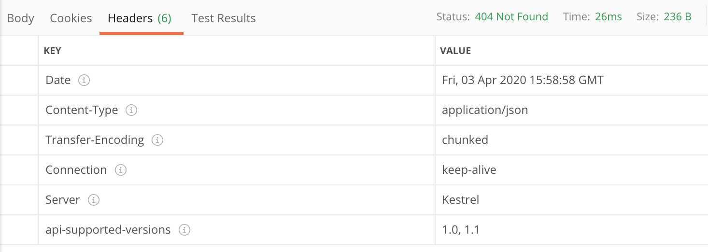
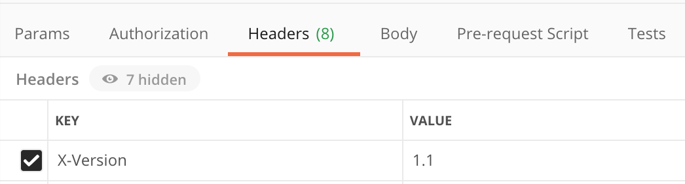
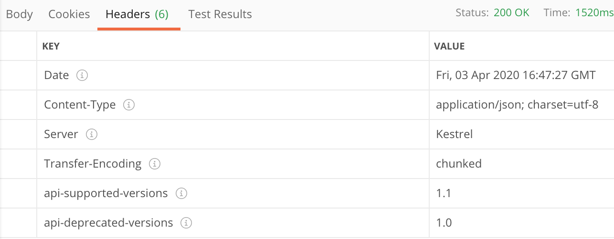

Microsoft has provided a Nuget package called `Microsoft.AspNetCore.Mvc.Versioning` to ease the process versioning .Net Core REST APIs. With the package installed, configure the default behaviour for API versioning.
<!--more-->

```csharp
// Startup.cs
services.AddApiVersioning(config =>
{
    config.DefaultApiVersion = new ApiVersion(1, 0);
    config.AssumeDefaultVersionWhenUnspecified = true;
    config.ReportApiVersions = true;
    config.ApiVersionReader = new HeaderApiVersionReader("X-Version");
});
```

Specify the default API version as 1.0 and use the version if the client hasn’t specified the API version in the request. To advertise the available versions, set the ReportApiVersions property to true. Then, the client gets a response header, `api-supported-versions` with the versions.



## Version specific Controllers and Actions
When the clients make request for a specific version of an API endpoint, the request should be redirected to the appropriate controller or action handling the requested API version. There are multiple approaches on how to assign controllers and actions to handle version specific requests. 

Separate controllers can be created for each API versions and the request will be directed to a particular controller based on the requested API version. However, to keep it simple we use a single controller with multiple versions.

```csharp
[ApiVersion("1.0")]
[ApiVersion("1.1")]
[ApiController]
[Route("[controller]")]
public class JakeController : ControllerBase
{
    [HttpGet("{id}")]
    [MapToApiVersion("1.0")]
    public async Task<IActionResult> Get(int id)
    {
        var command = new GetJakeCommand {Id = id};
        var result = await mediator.Send(command);

        return Ok(result);
    }

    [HttpGet("{id}")]
    [MapToApiVersion("1.1")]
    public async Task<IActionResult> GetV1_1(int id)
    {
        var command = new GetJakeCommand {Id = id};
        var result = await mediator.Send(command);

        return Ok(result);
    }
}
```

If an action has no `MapToApiVersion` attribute, it’s assumed to have the default version of 1.0. C# doesn’t allow to have the same method name with the same signature so the method name should be different.

## Versioning Strategies
Now that the API supports multiple version, we need a way to allow clients to specify the API version they are requesting. There are few different approaches on how to allow clients to send the versioning information when making the request.

### Using query params
The default versioning scheme provided by the Microsoft.AspNetCore.Mvc.Versioning package makes use of a query param `api-version`.

```
https://{domain}/api/controller?api-version=1.1
```

My API requires, in some cases, the query string to provide the paging details and search criteria. Adding more element to the query string may increase the complexity of composing a request.

### Using request headers
Another approach to versioning an API is using request headers where a header value specifies the API version. Unlike the URL path param and query string approach, using request header doesn't require fiddling around with the URLs on the client side. The downside to using request headers for versioning is that the versioning option is not explicitly visible to the client at a first glance.



### Using media type (Accept header)
Another approach of version the API is using the content negotiation process provided by HTTP. When client requests a resource using the Accept header, they could explicitly include the version number in the media type itself.

```
GET /resource/4
Accept: application/json;v=1.1
```

Server could read the Accept header and respond with the appropriate API version. It’s like a header recycle to see the bright side. A disadvantage is that it is obscure, difficult to implement and not immediately obvious to clients that they can request different API versions using the Accept header.

### Using URL path

Using a version number directly in the URL path is one of the simplest way of versioning an API. URL path versioning approach is more visible since it explicitly states the version number in the URL itself. However, this approach mandates clients to change their URL across their application whenever there is a new API version. Furthermore, embedding the API version into the URL itself would break a fundamental principle of REST API which states that each URL should represent a particular resource and the resource URL should not change over time. This approach is better suited in cases when every new API version has broad major changes.

```
https://{domain}/api/v1.1/resource
```

## Supporting multiple versioning

It is possible to support multiple API versioning schemes to provide flexibility and give options to the clients to use the versioning scheme of their choice.

```
config.ApiVersionReader = ApiVersionReader.Combine(new HeaderApiVersionReader("X-Version"), new QueryStringApiVersionReader("api-version"));
```

## Advertising the deprecated versions

Similar to advertising the supported API versions for an endpoint, API versions which will be deprecated in the near future can also be advertised by setting the deprecated property to true in the ApiVersion attribute. The client could read the `api-deprecated-versions` in the response header and identify the deprecated API versions.

```
[ApiVersion("1.0", Deprecated = true)]
[ApiVersion("1.1")]
[ApiController]
[Route("[controller]")]
public class JakeController : ControllerBase
{
   ...
}
```



## Conclusion

My chosen API versioning scheme is using request headers. It doesn’t pollute the URL and doesn’t share a request header. 

A customer header `X-Version` is used to specify the API version.


