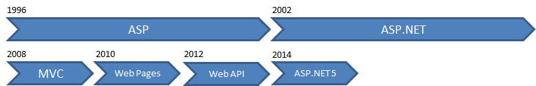
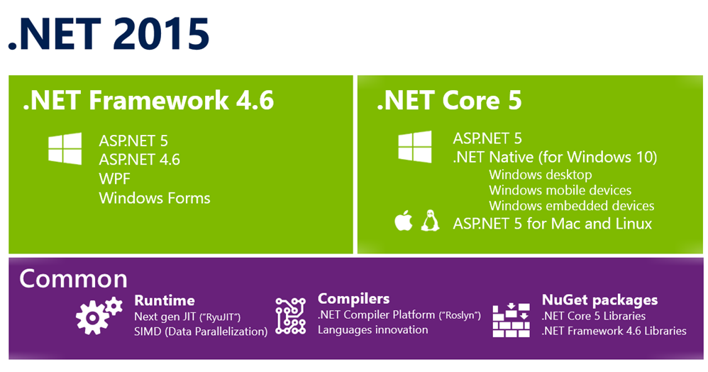
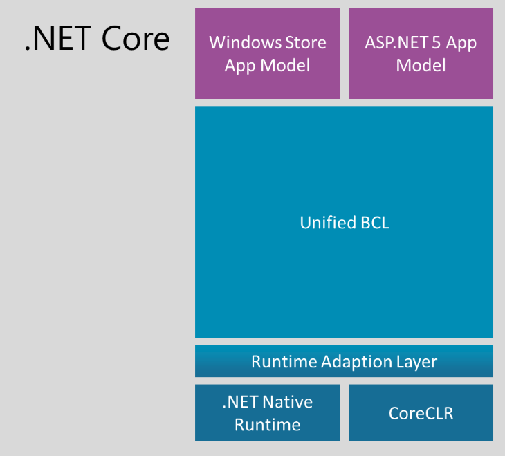
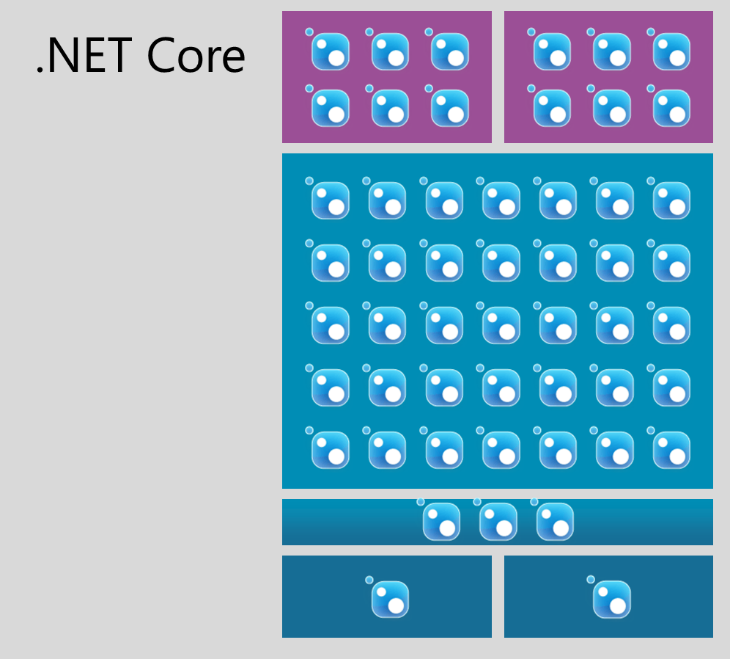

2014년 2월 취임한 사티아 나델라(Satya Nadella), 마이크로소프트의 최고경영자는 ‘모바일 퍼스트, 클라우드 퍼스트(Mobile First, Cloud First)’라는 비전과 함께 변화를 주도했다. 아이패드용 오피스를 출시하고 일부 제품을 무료로 전환하고 닷넷 프레임워크의 소스를 공개하는 등, 이전의 MS라면 상상할 수 없던 변화를 보여줬다. 이 비전엔 어떤 의미가 있을까.

# ASP.NET Reboot

사티아 나델라 CEO가 정의하는 모바일은 단순히 스마트폰, 태블릿을 지칭하는 게 아니라는 점에 주목해야 한다. 장치의 이동성이 아닌 사용자 경험의 이동성이다. 이것은 어떤 환경에서도 비슷한 사용자 경험을 제공할 수 있어야 한다는 의미다. 그 환경은 맥, 리눅스, 윈도우 기반의 데스크톱처럼 플랫폼이 다를 수도 있고, 스마트폰, 태블릿처럼 장치가 다를 수도 있다. 

다른 플랫폼, 다른 장치에서 연속되는 사용자 경험을 제공해야 한다는 관점에서 클라우드는 백엔드로서 자리매김할 수 있다. 한편으로 클라우드는 클라우드 최적화된 애플리케이션이 있어야 그 진가를 발휘할 수 있는 상황에서 ASP.NET은 어떻게 바뀌어야 하고, 바뀌게 될까. 잠깐 ASP의 역사를 살펴보자.

[그림-1] ASP의 발전 과정

지난 18년 동안의 역사에서 가장 큰 변화는 ASP.NET의 등장이다. ASP가 소개된 지 6년 뒤의 일이다. ASP.NET의 등장 뒤 6년이 지난 2008년에는 MVC가 새로운 웹 개발의 축으로 등장했다. 

올해는 MVC 등장 6년이 되는 해다. ASP.NET 5는 또 다른 지각변동을 시사하는 시점에 ASP.NET 등장을 넘어서는 변화를 준비하고 있다. 
현재 [오픈소스 프로젝트](https://github.com/aspnet/Home/)로 진행되고 있는 ASP.NET 프레임워크는 베타 5버전까지 진행됐는데 정확한 버전은 1.0.0 베타 5다. 앞의 메인 버전이 시사하는 바가 크다. 

ASP.NET 5 (닷넷 코어의 프로젝트명)의 변화는 ASP.NET의 REBOOT 라고 불릴만큼 양적으로나 질적으로나 알아볼 내용이 많다. 새롭게 시작하는 ASP.NET 의 중요한 변화를 한 가지씩 자세히 알아보도록 하겠다.

# .NET Core
닷넷 프레임워크는 2002년 단일 프레임워크로 등장했다. 바로 이어서, 윈도우 모바일을 위한 경량 버전인 닷넷 컴팩트 프레임워크라는 서브셋(subset)을 출시했는데, 이 컴팩트 프레임워크는 닷넷 프레임워크에 기반해서 만들었지만 그 자체로 `실행환경(runtime)`, `프레임워크`, `애플리케이션` 모델을 갖는 형태로 디자인되었기 때문에 별도의 코드 기반(code base)이라 할 수 있다. 즉, 윈도우 모바일에서 애플리케이션을 작성하기 위해서는 닷넷 프레임워크가 아닌 닷넷 컴팩트 프레임워크를 사용해야 한다는 의미다. 

이렇게 실행환경, 프레임워크, 애플리케이션 모델을 모두 갖춘 형태를 `버티컬(vertical)`이라고 한다. 이런 방식의 지원은 실버라이트, 윈도우 폰, 최근의 윈도우 스토어까지 이어져 여러 개의 버티컬들을  만들어 냈고 닷넷 플랫폼은 하나가 아닌 여러 플랫폼의 집합이 됐다.

[그림-1] 닷넷 버티컬

특별한 환경, 특별한 요구사항을 만족시키기 위해 특화된 버티컬을 제공하는 것이 잘못된 것은 아니다. 그러나, 지금하고 있는 프로젝트의 요구 사항을 한번 살펴보자. 오늘날, 웹 서버를 백엔드로 두면서 관리자용 데스크톱 애플리케이션과 일반 사용자를 위한 웹과 모바일 애플리케이션을 제공하는 건 더 이상 특별한 요구사항이 아니다. 따라서, 여러 버티컬에서 수평적으로 운영할 수 있는 애플리케이션을 만들 수 있는 효과적인 방법이 필요하다.

[그림-2] 닷넷 프레임워크와 닷넷 코어

닷넷 코어는 모놀리식(monolithic) 닷넷 프레임워크를 모듈화하고자 하는 접근법에서 비롯되었다. 닷넷 코어는 닷넷 코어 런타임인 `CoreCLR`과 닷넷 코어 라이브러리인 `CoreFX`로 구성되고 이들은  버티컬에서 각각 런타임과 프레임워크에 해당한다. 좀더 자세한 구조는 아래 그림과 같다.

[그림-3] 닷넷 코어 버티컬

CoreCLR을 런타임으로 하는 축을 살펴보면 애플리케이션 모델로 ASP.NET 5가 있다 - ASP.NET 5 앱 모델의 이해하기 쉬운 예는 MVC 다. 반면에 닷넷 네이티브 런타임(.NET Native Runtime)은 터치기반 장치들의 실행환경이고 애플리케이션 모델을 통해 윈도우 클라이언트용 앱 개발을 지원한다. 주목할 부분은 `Unified BCL`인데 런타임과 애플리케이션 모델이 달라도 BCL이 같다는 것이다.

이 사실은 <그림 1>의 프레임워크와 근본적인 차이를 갖는다. 프레임워크에서 제공되는 Collection을 예로 들면, <그림 1>의 구조가 모든 버티컬에서 Collection을 똑 같이 구현하고 있는 반면, 닷넷 코어의 프레임워크는 여러 개가 아닌 단일 프레임워크에서 Collection을 구현한다.

닷넷 코어가 통합된 BCL을 중심으로 하는 새로운 버티컬을 정의했다는 것은 중요한 의미를 갖는다. 통합된 BCL을 통해 개발자에게 일관적인 프로그래밍 모델을 지원하면서 또 다른 런타임과 애플리케이션 모델을 추가할 수 있는 확장적인 버티컬이 탄생한 것이다.

닷넷 코어 플랫폼은 `NuGet 패키지`의 집합으로 배포된다. 

[그림-4] 닷넷 코어 플랫폼은 NuGet 패키지의 집합

현재의 모놀리식 닷넷 프레임워크도 유지되지만 동시에 점차 NuGet 패키지로 모듈화되어 CoreFX 라이브러리를 구성해갈 것이다. WCF를 모듈화하는 작업이 근래에 시작되었고 CoreFx 라이브러리로써 NuGet에서 다운로드하여 설치할 날이 곧 올 것이다. 이렇게 애플리케이션에 필요한 기능만을 가져다 사용하는 `pay-as-you-play` 모델이라 가볍고 배포상의 이점이 있다. 또한, 모놀리식 프레임워크에서 분리되는 각 모듈들은 작은 단위의 패키지로 배포되기 때문에 업데이트/패치의 주기가 빨라져서 개발자의 입장에서는 환영할 일이다.

CoreFX 라이브러리들이 NuGet 패지지로 제공되는 것처럼CoreCLR 또한 NuGet 패키지로  애플리케이션에 포함되는데, CoreCLR은 런타임으로써 운영체제에 독립적인 실행환경을 제공하는 것이 목적이다. CoreCLR에 대한 자세한 내용은 [Github 리포지토리](https://github.com/dotnet/coreclr)를 참고하자.

닷넷 코어는 일년에 네 번 정도 업데이트를 하며 닷넷 프레임워크 보다 버전이 앞서 갈 것이고 닷넷 프레임워크는 닷넷 코어의 변화를 수용하는 방식으로 일년에 한 번 정도 업데이트가 될 것이다. 
