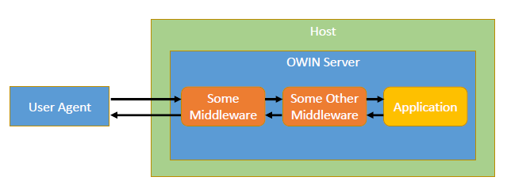

ASP.NET에서는 `System.Web` 을 사용하여 http 요청을 처리해 왔고 데이터 운반책인 `HttpContext.Current`는 32KB의 메모리를 차지했다. 이 것은 요청하는 웹 페이지의 복잡도에 상관없이 하나의 세션당 무조건 필요한 메모리 크기이므로 다소 불합리하다고 할 수 있었다. ASP.NET 5의 http 요청 처리는 Node.js 스타일의 raw socket 과 유사하게 변경되었고 단지 3KB의 메모리만을 차지한다. 이렇게 90% 감소된 메모리 사용은 로딩 타임을 줄여 사용자 요청에 빠르게 응대하고 동시에 더 많은 요청을 처리할 수 있게 해준다. 이런 성능 향상의 배경에 미들웨어가 있다. <!--more-->

# 미들웨어 아키텍쳐



<그림 1> 미들웨어 아키텍쳐 

그림에서 OWIN Server 영역 내에 있는 것은 모두 미들웨어이고 마지막 미들웨어가 최종 응답을 생성하고 있어서 애플리케이션의 역할을 한다고 볼 수 있다. 좋은 예로 MVC 6는 애플리케이션 역할을 하는 미들웨어다. 이렇게 미들웨어의 체인에서는 중간 과정의 어떤 미들웨어던지 응답을 반환하는 것으로 작업을 마칠 수 있어서 아주 유연하고 확장성이 좋다.

미들웨어는 OWIN에서 그 개념을 가져왔지만 `HttpContext` 와 `RequestDelegate`만을 높은 수준에서 추상화한 작은 개념이다. 미들웨어는 요청 파이프라인에서 콘텍스트 객체를 통해 정보를 읽고 쓸 수 있다. 또한 응답을 반환함으로써 파이프라인을 종료하거나, 다음 미들웨어를 호출하여 작업을 이어갈 수 있다. 미들웨어 간의 호출은 비동기로 이루어지기 때문에 서버 리소스 활용 측면에서도 효율적이다.

미들웨어를 구현하려면 `HttpContext`를 인자로 받고 `Task` 객체를 반환하는 메소드(리플렉션으로 찾기 때문에 메서드 명은 상관없다)와, `RequestDelegate`를 입력 인자로 받는 생성자를 클래스에 정의하면 된다.

<리스트 1> 미들웨어 구현

```csharp
public class MyMiddleware
{
    private readonly RequestDelegate _next;

    public MyMiddleware(RequestDelegate next)
    {
        _next = next;
    }

    public async Task Invoke(HttpContext context)
    {
        // do something
        // ...

        // call next middleware
        await _next(context);
    }
}
```

`Invoke` 메서드의 `HttpContext`는 `System.Web`이 아닌 `Microsoft.AspNet.Http` 네임스페이스에 있다. 이것으로 HTTP 요청처리 방식이 변경되었다는 사실을 알 수 있다. 생성자로 받는 `RequestDelegate`의 정의를 추적해 보면 미들웨어가 되기 위한 요건 중 꼭 있어야 할 메서드의 정의와 동일하다.

```csharp
public delegate Task RequestDelegate(HttpContext context);
```

즉, 미들웨어 생성과 함께 다음에 호출할 미들웨어를 전달 받아 보관한 후, 필요한 시점에 다음 미들웨어로 프로세스를 넘길 수 있는 구조이다. 미들웨어 사용은 `Startup` 클래스의 `Configure()` 메서드에서 `app.UseMiddleware<MyMiddleware>()` 메서드를 사용하여 구성한다.

미들웨어를 구성할 때, 이렇게 선형적(linear) 방식 뿐 아니라 분기(branch)할 수 있는 방법도 제공한다. 예를 들어, 에러 처리를 위한 미들웨어를 구성한다고 할 때, 오류시 에러 페이지를 반환한다고 하자. 그러나, API에 대한 요청은 JSON 또는 XML 포맷의 응답을 기대할 것이기에 여기에 html 페이지를 반환하는 것은 이해할 수 있는 구성이 아닐 것이다. 아래 코드에서는 `/api` URL로 들어오는 요청에 대해 다른 구성 메서드로 분기하는 방법을 보여준다. 

<리스트 2> 미들웨어 분기

```csharp
using Microsoft.AspNet.Builder;
using Microsoft.AspNet.Http;

namespace MyApplication
{
	public class Startup
	{
		public void Configure(IApplicationBuilder app)
		{
			app.Map("/api", ConfigureApi);

			app.Run(async (context) =>
			{
				await context.Response.WriteAsync("Hello World!");
			});
		}

		private void ConfigureApi(IApplicationBuilder app)
		{
			app.Run(async (context) =>
			{
				await context.Response.WriteAsync("Hello World from API!");
			});
		}
	}
}
```

미들웨어의 분기적인 구성에 대해 자세한 내용은 다음 링크에서 확인할 수 있다.

[Non-linear middleware chains in ASP.NET 5](http://blog.dudak.me/2015/non-linear-middleware-chains-in-asp-net-5)

# 호스팅 환경의 영향

개발자가 직접 요청 파이프라인을 구성하는 방식때문에 해당 구성이 없으면 간단한 html 페이지도 브라우저에 보낼 수 없다 (성능이 대폭 향상된 근본적인 이유이다). 그러나, `app.UseStaticFiles()`처럼 많은 확장 메서드들이 편의를 위해 제공되므로 기본적인 작업 때문에 개발자가 수고를 들일 필요는 없다.

요청 파이프라인을 스스로 처리할 수 있는 능력 덕분에 셀프 호스팅이 쉬워졌다. `Microsoft.AspNet.Server.WebListener`처럼 기본적으로 제공되는 호스팅 환경을 사용할 수도 있지만 닷넷 매니지드 코드로 작성된 모든 애플리케이션에서 ASP.NET 5 앱을 호스팅할 수 있다. 

만약, static 파일(image, html 등)을 미들웨어를 통해 처리하지 않는데도 불구하고 브라우저에서 볼 수 있다면  호스팅 환경(특히, IIS)에서 파일 시스템에 기반해서 요청을 처리하기 때문이다. 

기존 MVC 5 애플리케이션에서도 이런 현상이 있는데, 웹 서버가 애플리케이션보다 요청을 먼저 받고 처리하기 때문에 MVC 입장에서는 정적 파일에 대해 라우팅 전략을 가져가기 어렵다. 이런 현상을 막으려면 RegisterRoutes 메서드의 첫 줄에서 존재하는 파일에 대해 라우팅을 한다고 프레임워크에 알린다.

```csharp
public static void RegisterRoutes(RouteCollection routes)
{
    routes.RouteExistingFiles = ture;
    
    ...
}
```

IISExperss 가 간섭하는 것을 막기 위해 설정 파일을(C:\Users\\{username}\Documents\IISExpress\config\applicationhost.config)을 열고 UrlRoutingModule-4.0 항목의 perCondition 어트리뷰트에 빈 값을 할당한다.

```html
<add name="UrlRoutingModule-4.0" type="System.Web.Routing.UrlRoutingModule" preCondition="" />
```  
    

개인적인 의견이지만 전통적인 ASP.NET + IIS 의 강력한 조합은 ASP.NET 미들웨어의 등장과 함께 재정리되어야 할 것 같다. 웹 서버의 종속성이 없어진 상황에서 웹 서버의 역할을 어떻게 규정해야 할까?