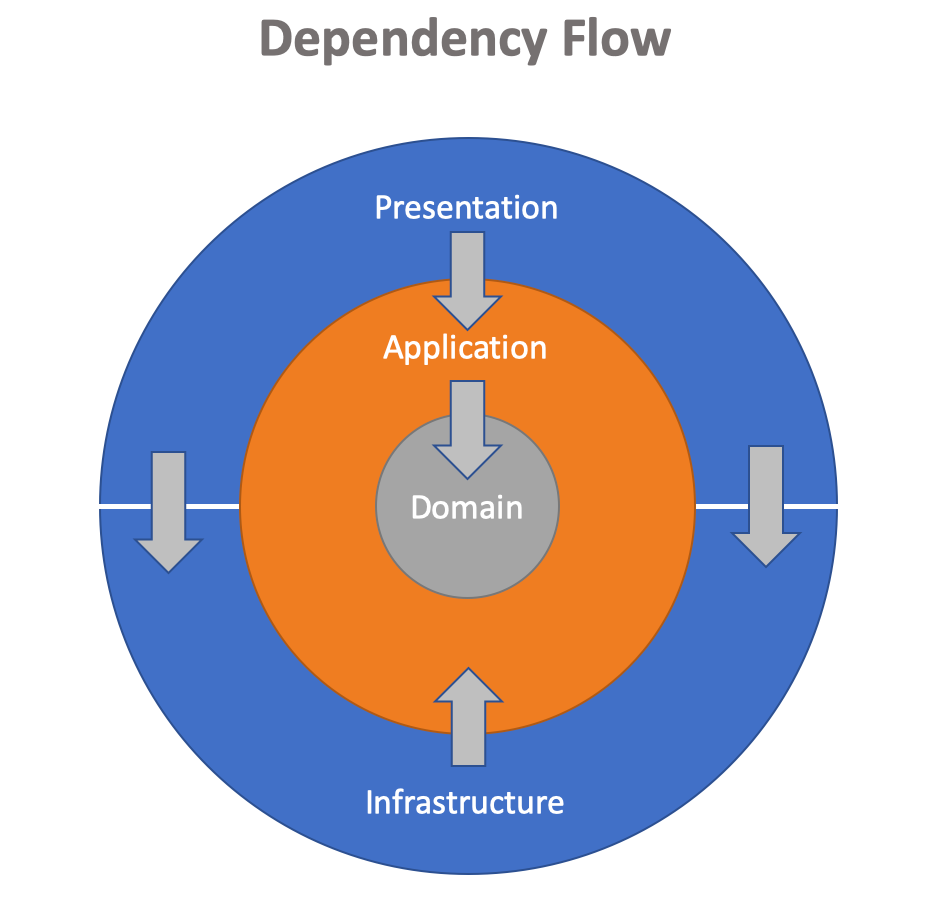
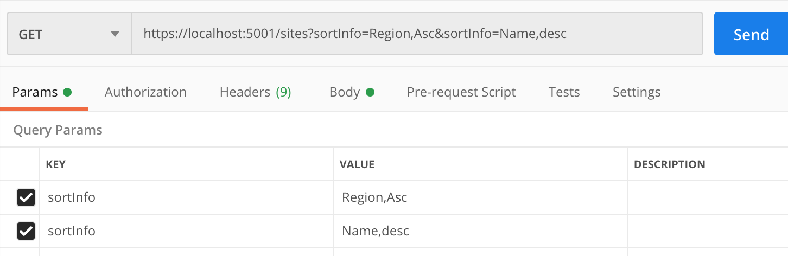

비지니스 애플리케이션을 작성할 때 상당부분을 CRUD 작업에 할애한다. 도메인 엔티티만 바꿔가며 반복적으로 비슷한 구현을 하다보면 좋은 패턴을 적용해야겠다는 생각을 하게된다. 검색과 정렬도 CRUD 작성과 비슷해서 최대한 반복을 줄이면서 재사용성을 높이는 방법이 필요하다.
<!--more-->

효율적인 검색과 정렬을 알아보기 앞서 예제에서 활용하는 애플리케이션 구조에 대해 설명하고자 한다.

## Clean Architecture

클린 아키텍쳐는 오니언 아키텍쳐와 비슷하며 클린 코드로 유명한 엉클 밥(Robert C. Martin)이 주창하는 아키텍쳐 패턴이다. 필자가 가장 즐겨 사용하는 아키텍쳐인데 그 이유는 단방향으로 정리되는 깨끗한 종속성 관리때문이다.



위 다이어그램에서 화살표는 레이어간 종속성의 흐름을 나타내고 있다. 간단하게 각 레이어의 역할과 종속성 측면의 관계를 정리해 보면,

- `Domain` 레이어는 엔티티, Value Object등을 포함하는데 애플리케이션을 넘어서는 엔터프라즈 단위의 로직을 구현한다. 유일하게 종속성이 없는 레이어고 다른 애플리케이션에 의해 재사용될 수 있도록 구성한다.
- `Application` 레이어는 유일하게 `Domain` 레이어에 종속성을 갖으면서 그 것을 감싸고 있다. 애플리케이션으로써 알아야할 것을 도메인으로부터 획득하며 애플리케이션이 해야할 일을 또는, 인프라스트럭쳐가 구현해야 할 모든 행동을 인터페이스로 정의한다. `Domain` 레이어가 각 엔티티별 특화된 로직을 구현하는 반면 이 레이어는 여러 도메인과 인프라스트럭쳐를 사용하여 유스케이스를 구현한다. 클린 아키텍쳐의 핵심 레이어이므로 이 레이어에서 많은 코딩을 할 것이다.
- `Presentation` 레이어는 사용자 인터페이스를 제공하며 사용자의 입력은 애플리케이션의 기능을 통하여 처리된다. 따라서, `Application` 레이어에 종속성을 갖고 있으며 이메일 서비스등 외부 서비스가 정의되는 `Infrastructure` 레이어에도 의존하다. REST API는 비록 UI는 없지만 사용자 요청을 처리하기 때문에 이 레이어에 속한다고 본다.
- 마지막으로 `Infrastructure` 레이어는 앞서 언급한 레이어에 포함되지 않는 모든 것이다. 중요한 컴포넌트로 데이터 입축력을 담당하는 Persistence 서비스, 통신을 담당하는 Notification 서비스 등이 있다. `Presentation` 레이어처럼 `Application` 레이어에 종속성을 갖고 있다.

이 그림에서 알 수 있듯이 종속성의 방향은 바깥에서 안으로 향한다. 그렇지 않은 경우는 프레젠테이션과 인프라스트럭쳐의 관계처럼 같은 레벨에서 종속성을 갖는다. 레이어간 참조(종속성)를 단방향으로 유지하는 개념은 상당히 중요하다. 이에 입각해서 무엇을 어디에 구현해야하는지 판단할 수 있기 때문이다. 이 아키텍쳐의 훌륭한 점은 별도 포스팅으로 정리하기로 하고 이 아키텍쳐의 글루(Glue)같은 존재인 MediatR 에 대해 알아보자.

## MediatR

앞서 설명한 각 레이어는 별도 프로젝트가 되어 솔루션을 구성할 수도 있고, 하나의 프로젝트에서 폴더로 구분되어질 수도 있다. 레이어(Layer)는 티어(Tier)와 달리 논리적인 구분이기 때문에 한 프로세스에서 같이 동작하는한 별도 어셈블리인지 아닌지에 대한 구분은 필요없다.

사용자 요청을 API(프레젠테이션)에서 받아 애플리케이션 레이어(이하, 애플리케이션)로 보낼때, 그 과정을 느슨하게 결합하고 싶다면 Mediater 패턴을 사용한다. 

> Mediator is a behavioral design pattern that reduces coupling between components of a program by making them communicate indirectly, through a special mediator object.

`MediatR`는 (스페링 오류가 아니다. e가 생략됐다) `Automapper` 로 유명한 [Jimmy Bogard](https://jimmybogard.com/)가 닷넷 환경을 위해 작성한 mediater 패턴의 구현체다. 대표적으로 Send() 메서드를 사용하여 클래스간의 관계를 느슨하게 유지한다. 이 것 말고도 활용할 소지가 많은데 이 것 또한 별도 포스팅을 차지할 만큼 내용이 알차다.

## 검색

검색과 정렬을 다룬다면서 사설이 길었다. 구조를 이해하지 않고는 예제가 쉽게 다가오지 않을 것 같아 시간을 할애해 아키텍쳐와 MediatR에 대해 간단히 알아보았다. 이제, 검색에 대한 예제를 보면서 또 하나의 패턴인 커맨드-핸들러를 만나보자.

```csharp
public OrdersController(IMediator mediator)
{
    this.mediator = mediator;
}

[HttpGet("Search")]
public async Task<IActionResult> Get([FromQuery] SearchOrderByCommand command)
{
    var entities = await mediator.Send(command);

    return Ok(entities);
}
```

이 코드는 `OrdersController`에서 검색에 사용되는 액션이다. `/api/orders/search/?Name=abc&PageNumber=1&PageSize=50` 주소로 접근하는데 쿼리 스트링으로 검색할 내용을 전달한다. 모델 바인더는 쿼리 스트링을 분석해 `SearchOrderByCommand` 객체로 변환해 준다. 모델 바인딩이 가능한건 쿼리 스트링의 파라미터가 이 객체의 속성에 대응하기 때문이다.

```csharp
public class SearchOrderByCommand : IRequest<PagedListDto<Order>>
{
    // 검색 정보
    public string Name { get; set; }

    // 페이징 정보
    public int PageNumber { get; set; }
    public int PageSize { get; set; }    
}
```

이렇게 사용자 요청을 커맨드 객체로 추상화 했다. 이 객체가 구현하는 `IRequest`는 `MediatR`가 정의하는 인터페이스인데 두 가지 내용을 알려준다. 

- `MediatR`에는 크게 `Request(요청)`과 `Notification(알림)`의 두가지 카테고리가 있는데, 이 커맨드가 요청이라는 것과 
- 이 것을 핸들링하는 객체는 `PagedListDto<Order>` 타입을 반환해야 한다는 것이다. 

핸들러는 커맨드 객체의 nested class로 같은 파일에 아래와 같이 구현한다.

```csharp
public class Handler : IRequestHandler<SearchOrderByCommand, PagedListDto<Order>>
{
    private readonly IAppContext context;
    private readonly IMapper mapper;

    public Handler(IAppContext context, IMapper mapper)
    {
        this.context = context;
        this.mapper = mapper;
    }
    
    public async Task<PagedListDto<Order>> Handle(SearchOrderByCommand request, CancellationToken cancellationToken)
    {
        var pageInfo = PageInfo.Create(request.PageNumber, request.PageSize);   // 페이징 정보

        var query = context.Orders.AsQueryable();
        if (!string.IsNullOrEmpty(request.Name))
        {
            query = query.Where(s => s.Name.Contains(request.Name));    // 검색조건 추가
        }
            
        var pagedList = await query.ToPagedListAsync(pageInfo.Number, pageInfo.Size, cancellationToken);
        
        return mapper.Map<IPagedList<Order>, PagedListDto<Order>>(pagedList);
    }
}
```

`IRequestHandler` 인터페이스를 구현하면서 커맨드 객체의 타입과 반환 타입을 제공한다. 이렇게 선언적인 방법으로 커맨드 객체와 연결되기 때문에 `mediator.Send(command)` 메서드를 호출하면 핸들러의 `Handle` 메서드가 실행된다. 그리고, 코드에서처럼 `request` 파라미터를 통해 커맨드 속성에 접근하여 사용자 입력값을 검색에 사용할 수 있다.

페이징 관련 처리나 매핑 처리는 이 글의 범위를 넘는 또하나의 포스팅 거리라 아껴 두기로 한다. 여기서는 검색어를 어떻게 전달하고 LINQ에서 처리하는지 알아보는 것이 핵심이다. 예제에서는 `Name`이라는 하나의 속성만 사용했지만 검색에 필요한 다른 속성을 추가하고 `request.Name`을 사용해 쿼리에 검색조건을 추가한 것과 유사하게 처리하면 된다.

> 위에 사용한 예제들을 아키텍쳐 관점에서 부연설명하면, `OrdersController`는 프레젠테이션, `SearchOrderByCommand`와 핸들러는 애플리케이션에 구현한다. 애플리케이션의 대부분은 이처럼 커맨드-핸들러의 형태의 기능 구현이다. `Order`는 엔티티로써 도메인 레이어에 위치한다. `AppContext`는 엔티티 프레임워크의 `DbContext` 파생 클래스이고 인프라스트럭쳐에 위치한다. `IAppContext` 인터페이스는 애플리케이션에서 정의하고 실제 구현은 인프라스트럭쳐 레이어에 포함되는 Persistence 서비스가 제공한다.

종속성 정리가 잘 되어야 레이어간 순환 참조 문제를 피할 수 있고 각 레이어의 역할에 충실할 수 있다.

## 정렬

검색은 다루는 도메인에 따라 검색조건이 달라지기 때문에 일반화하기가 어렵다. 반면, 정렬은 모든 행위가 동일한데 단지 정렬하고자 하는 필드와 정렬 순서만 바뀐다. 아래 테스트를 통해 상황을 정리해 보자.

```csharp
public class Device  // 정렬에 사용할 도메인 엔티티
{
    public int Id { get; set; }
    public string Name { get; set; }
    public Category Category { get; set; }
}

public enum Category
{
    Computing,
    Mobile
}

public class SortingTests   // xUnit 테스트
{
    private ICollection<Device> devices;

    public SortingTests()
    {
        devices = new List<Device>  // 테스트를 위한 디바이스 컬렉션을 만든다
        {
            new Device {Id = 1, Name = "MacBook Pro", Category = Category.Computing},
            new Device {Id = 2, Name = "iPhone", Category = Category.Mobile},
            new Device {Id = 3, Name = "iPad", Category = Category.Mobile}
        };
    }

    [Fact]
    public void SortingDevices_ByNameAscOrder()
    {
        var query = devices.AsQueryable();
        // query = query.OrderBy(d => d.Name);  이 쿼리는 Device 정렬에서만 사용할 수 있다
        query = query.OrderByProperty("Name", QuerySortOrder.Asc);  // 위 문장과 같은 일을 다른 방식으로 표현

        var result = query.ToList();

        result[0].Name.Should().Be("iPad");
        result[1].Name.Should().Be("iPhone");
        result[2].Name.Should().Be("MacBook Pro");
    }
}
```

`OrderBy` 메서드는 `IQueryable`에서 제공하는데 쿼리가 device 리스트에서 시작하므로 device 객체에 바인딩되어 있다. 또한, 내림차순 정렬을 원한다면 `OrderByDesending()` 메서드로 바꿔 사용해야 한다. 그래서, 쿼리를 시작하는 도메인 엔티티에 상관없이, 정렬순서에 상관없이 같은 메서드를 사용하고 싶어서  `OrderByProperty()` 라는 `IQueryable`의 익스텐션 메서드를 추가해 봤다.

```csharp
public static class IQueryableExtensions
{
    public static IQueryable<TEntity> OrderByProperty<TEntity>(this IQueryable<TEntity> source, string sortProperty,
        QuerySortOrder sortOrder) 
    {
        var method = sortOrder == QuerySortOrder.Desc ? "OrderByDescending" : "OrderBy";
        var type = typeof(TEntity);
        var property = type.GetProperty(sortProperty, BindingFlags.IgnoreCase | BindingFlags.Public | BindingFlags.Instance);
        var parameter = Expression.Parameter(type, "p");
        var propertyAccess = Expression.MakeMemberAccess(parameter, property);
        var orderByExpression = Expression.Lambda(propertyAccess, parameter);
        var resultExpression = Expression.Call(typeof(Queryable), method, new Type[] { type, property.PropertyType },
            source.Expression, Expression.Quote(orderByExpression));
        
        return source.Provider.CreateQuery<TEntity>(resultExpression);
    }
}
```

`IQueryable`를 구성하는 익스프레션 트리를 다루는데 정렬을 위한 익스프레션을 추가하고 있다. 문자열로 전달된 속성(`sortProperty`)을 리플렉션을 통해 찾는데 대소문자 구분없이 동작하게 하려고 사용한 BindingFlags 옵션이 중요하다.

이 코드는 예상대로 동작하지만 그 노력에 비해 얻는 효과가 별로 없어 보인다. 이 지식을 토대로 멀티 정렬에 도전해 보자.

```csharp
[Fact]
public void SortingDevices_ByCategoryDescAndIdAsc_ShouldSortByTwoPropertiesInOrderRespectively()
{
    var sortInfo = new List<SortInfo>
    {
        new SortInfo("Category", QuerySortOrder.Desc),
        new SortInfo("Id", QuerySortOrder.Asc)
    };
    
    var query = devices.AsQueryable();
    query = query.OrderByProperties(sortInfo);  // 정렬 정보를 리스트로 받고 있어 한 줄로 멀티 정렬이 가능하다

    var result = query.ToList();

    result[0].Category.Should().Be(Category.Mobile);
    result[0].Id.Should().Be(2);
    
    result[1].Category.Should().Be(Category.Mobile);
    result[1].Id.Should().Be(3);
    
    result[2].Category.Should().Be(Category.Computing);
    result[2].Id.Should().Be(1);
}

public class SortInfo
{
    public string SortProperty { get; }
    public QuerySortOrder SortOrder { get; }

    public SortInfo(string sortProperty, QuerySortOrder sortOrder = QuerySortOrder.Asc)
    {
        SortProperty = sortProperty;
        SortOrder = sortOrder;
    }
}
```

위 코드에서 `query = query.OrderByProperties(sortInfo);` 라인이 인상적이다. 한 줄이지만 여러 건의 정렬 정보를 받아 처리하고 있다. 이 문장을 일반 LINQ로 변환하면 다음과 같을 것이다.

```csharp
if (sortInfo.Any(i => i.SortProperty.Contains("Category")))
{
    query = sortInfo.Single(i => i.SortProperty.Contains("Category")).SortOrder == QuerySortOrder.Asc 
        ? query.OrderBy(d => d.Category) 
        : query.OrderByDescending(d => d.Category);
}

if (sortInfo.Any(i => i.SortProperty.Contains("Id")))
{
    query = sortInfo.Single(i => i.SortProperty.Contains("Id")).SortOrder == QuerySortOrder.Desc
        ? query.OrderBy(d => d.Id)
        : query.OrderByDescending(d => d.Id);
}
```

단지 두개의 조건 뿐인데도 어쩔수 없이 고려해야할 내용때문에 코드가 길다. 뿐만아니라, 이런 패턴을 다른 곳에서도 계속 반복하는 것은 유지보수 차원에서도 좋은 일은 아니다. 또 한가지 문제가, 사실 오류가 있는데 잠시 생각해 보시길 바란다.

아래는 익스텐션 메서드에 대한 전체 구현코드다. 어떤 프로젝트에서든 붙여서 사용할 수 있을 것이다.

```csharp
public static class IQueryableExtensions
{
    public static IQueryable<TEntity> OrderByProperty<TEntity>(this IQueryable<TEntity> source, string sortProperty,
        QuerySortOrder sortOrder)
    {
        return BuildSortingExpression(source, sortProperty, sortOrder, true);
    }

    public static IQueryable<TEntity> OrderByProperties<TEntity>(this IQueryable<TEntity> source,
        IList<SortInfo> sortInfo)
    {
        if (!sortInfo.Any()) return source;

        for (var i = 0; i < sortInfo.Count(); i++)
        {
            var si = sortInfo[i];

            source = BuildSortingExpression(source, si.SortProperty, si.SortOrder, i == 0);
        }

        return source;
    }

    private static IQueryable<TEntity> BuildSortingExpression<TEntity>(IQueryable<TEntity> source,
        string sortProperty, QuerySortOrder sortOrder, bool isFirstSorting)
    {
        var method = DecideOrderMethod(sortOrder, isFirstSorting);

        var type = typeof(TEntity);
        var property = type.GetProperty(sortProperty,
            BindingFlags.IgnoreCase | BindingFlags.Public | BindingFlags.Instance);
        
        if(property == null) throw new ValidationException("Property name is not valid");
        
        var parameter = Expression.Parameter(type, "p");
        var propertyAccess = Expression.MakeMemberAccess(parameter, property);
        var orderByExpression = Expression.Lambda(propertyAccess, parameter);
        var resultExpression = Expression.Call(typeof(Queryable), method, new Type[] {type, property.PropertyType},
            source.Expression, Expression.Quote(orderByExpression));
        
        return source.Provider.CreateQuery<TEntity>(resultExpression);
    }

    private static string DecideOrderMethod(QuerySortOrder sortOrder, bool isFirstOccurence)
    {
        if (isFirstOccurence)
        {
            return sortOrder == QuerySortOrder.Asc ? "OrderBy" : "OrderByDescending";
        }

        return sortOrder == QuerySortOrder.Asc ? "ThenBy" : "ThenByDescending";
    }
}
```

앞서 언급했던 문제는 멀티 정렬시 두번째부터 하는 정렬은 Order로 시작하는 메서드가 아닌 Then으로 시작하는 메서드를 사용해야 한다는 것이다. 이 것을 지키지 않으면 두번째 정렬이 첫번째 정렬의 결과를 뒤집어 첫번째 정렬이 아예 무시되는 오류가 발생한다.

최종 구현에서 `OrderByProperty()` 메서드는 이미 사용하고 있는 코드가 있어 호환성을 위해 남겨놨을 뿐 큰 의미가 없다. 정렬 대상이 하나이든 여러개든 `OrderByProperties()`를 사용하여 단 한줄로 정렬에 대한 고민을 해결할 수 있다.

이제 클라이언트에서는 어떻게 정렬 정보를 작성해야 할지 살펴보자.

## 클라이언트 코드

API에서는 문자열 배열로 정렬 정보를 받고 있다. 배열을 작성하는 것은 json 포맷을 사용하는 것이 편하지만 그러기 위해서는 Request Body에 붙여야 한다. GET 메서드에 Request Body를 보내는 것은 권장하지 않기 때문에 쿼리스트링으로 배열을 보낸다.

```csharp
[HttpGet]
public async Task<IActionResult> Get(int pageNumber, int pageSize, [FromQuery]string[] sortInfo)
{
    var command = new GetAllSiteCommand
    {
        PageNumber = pageNumber,
        PageSize = pageSize,
        SortInfo = SortInfo.Parse(sortInfo)  // 문자열 배열을 List<SortInfo>로 변환하는 헬퍼 메서드
    };

    var entities = await mediator.Send(command);

    return Ok(entities);
}
```

쿼리 파라미터명을 동일하게 사용하여 배열을 만드는데 각 요소는 정렬을 위한 속성명과 순서를 콤마로 구분하고 있다.



이렇게 전달된 배열을 POCO 리스트로 변환하려면 꽤 긴 코드가 필요하다. 그 과정은 `SortList` 클래스에 구현하여 숨겼다. Enum을 다루는 부분 때문에 다소 복잡해 보일 수 있다.

```csharp
public static IList<SortInfo> Parse(string[] sortInfo)
{
    var parsedSortInfo = new List<SortInfo>();

    if (sortInfo == null || !sortInfo.Any()) return parsedSortInfo;
    
    var result = sortInfo.Select(si =>
    {
        var sortPropOrderPair = si.Split(',');
        if (Enum.TryParse(typeof(QuerySortOrder), sortPropOrderPair[1], true, out var sortOrder))
        {
            return new SortInfo(sortPropOrderPair[0], (QuerySortOrder)sortOrder);
        }

        throw new ValidationException("Sort order is not valid");
    });
            
    parsedSortInfo.AddRange(result);

    return parsedSortInfo;
}

public enum QuerySortOrder
{
    Asc = 1,
    Desc = 2
}
```

## 마치며

API 또는 MVC의 컨트롤러는 최대한 thin 하게 유지해야 한다. 일부 로직을 여기서 구현하면 프레젠테이션을 교체하기 어렵고 모바일 앱을 같이 운영하는 경우에도, 해당 로직을 모바일 앱단에서 중복해서 구현해야 한다. 최대한 교통경찰 역할만을 고수해야 한다.

MediatR을 사용해서 커맨드 객체로 사용자 요청을 추상화 하였고 핸들러가 그 내용을 받아서 처리하고 있다. 이 과정은 애플리케이션 레이어에서 이루어 지는데 모든 커맨드가 `IRequest` 를 구현하기 때문에 모든 커맨드를 대상으로 필요한 일을 추가로 하는 것이 가능하다. 예을 들어, 커맨드 실행시간을 기록하여 성능 측정을 할 수 있고 유효성 검사를 자동화 할 수도 있다.

반복적으로 사용하는 LINQ 패턴을 찾아보고 `IQueryable` 익스텐션으로 캡술화하는 것을 권장한다.

검색과 정렬에 대해 필자가 적용하고 있는 패턴을 정리해 보았다. 이 글의 내용을 보완할 수 있게 개선점이나 더 좋은 아이디어를 댓글로 남겨주시면 업데이트하도록 하겠다.
