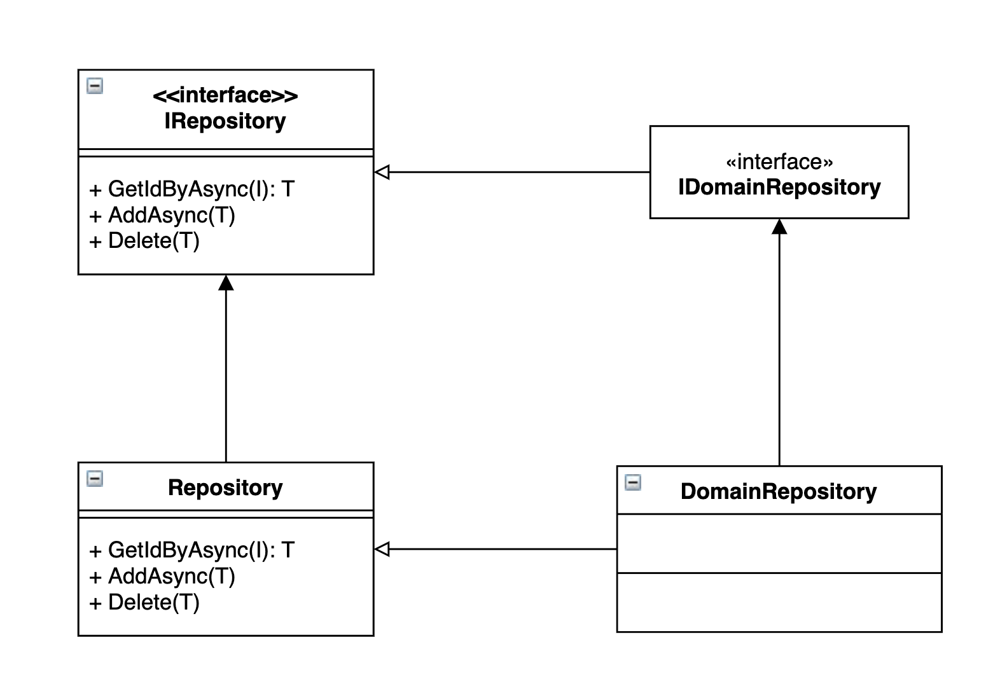
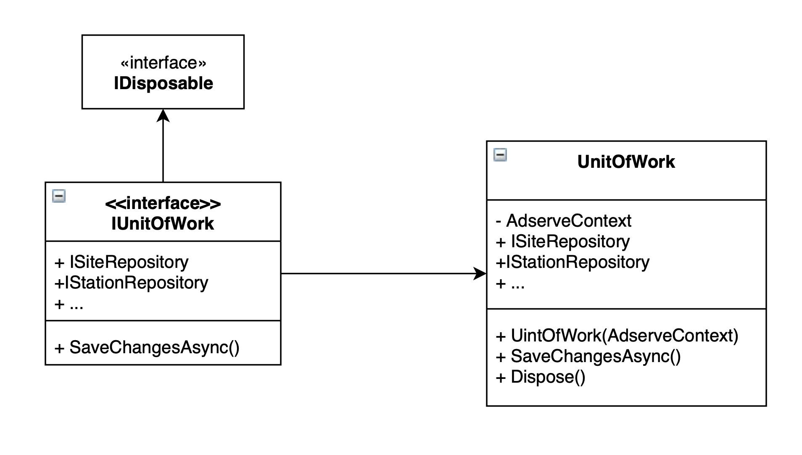
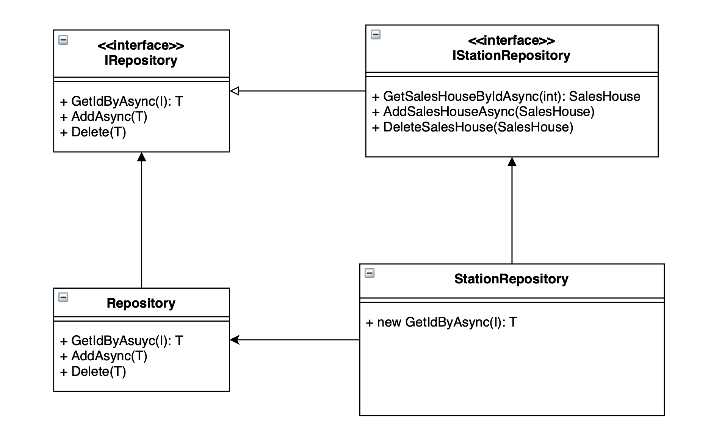

이전 글, [리포지토리 패턴과 엔티티 프레임워크 코어](/리포지토리-패턴)를 읽고 리포지토리 패턴을 구현하기로 결정했다면 이번 글에서는 엔티티 프레임워크 코어를 활용해서 손쉽게 구현하는 방법을 알아본다. (리포지토리는 정보 저장을 추상화할 때 사용하는 것으로 API를 호출해 다른 곳에 저장하는 것도 그 범주에 둘 수 있지만) 데이터베이스를 사용하는 것이 대부분의 애플리케이션 구성이므로 EF Core를 함께 사용해서 리포지토리 패턴을 구현해 보려고 한다. EF Core 자체가 리포지토리 / 유닛오브워크 패턴을 구현하고 있기 때문에 상당 부분이 델리게이트 형식을 취할 것이고, 코드 반복을 줄이기 위해 제네릭 리포지토리를 사용한다.
<!--more-->

## 제네릭 리포지토리

```csharp
public interface IRepository<T, I> where T : IEntity where I : struct
{
    Task<T> GetByIdAsync(I id);
    Task AddAsync(T entity);
    void Delete(T entity);
}
```

타입 `T`는 `IEntity`를 상속하는 클래스여야 하고 `I`는 int 또는 guild가 될 수 있는 ID 타입이다. `IEntity`는 `Id` 속성만을 정의하는데 이는 EF Core가 다루는 엔티티가 되기 위한 기본조건이다.

리포지토리는 메모리에 존재하는 컬렉션처럼 동작한다. 리스트의 아이템을 개별로 변경하면서 특별히 업데이트라는 메서드를 사용하지 않는 것처럼 리포지토리도 업데이트 기능은 필요없다. 아이템은 변경하려면 일단 ID로 조회하고 그 내용을 변경한다.생성을 포함한 모든 변경 내용은 유닛오브워크가 제공하는 저장 기능을 통해 최종 변경된다. 각각의 리포지토리가 저장 기능을 갖고 있다면 다른 리포지토리와 연계된 변경 내용을 동시 트랜잭션으로 처리할 수 없는 결함이 생긴다.

```csharp
public class Repository<T, I> : IRepository<T, I> where T : Entity where I : struct
{
    private readonly ApplicationContext context;
    
    public Repository(ApplicationContext context)
    {
        this.context = context;
    }
    
    public async Task<T> GetByIdAsync(I id)
    {
        var entity = await context.Set<T>().FindAsync(id);
        if(entity == null) throw new EntityNotFoundException(typeof(T).Name, id);
        
        return entity;
    }

    public async Task AddAsync(T entity) => await context.Set<T>().AddAsync(entity);

    public void Delete(T entity) => context.Set<T>().Remove(entity);
}
```

`Repository` 클래스는 `IRepository` 인터페이스에 대한 기본 구현이며 도메인 엔티티의 부모 클래스 역할을 한다. 생성자를 통해 `DbContext`를 받고 이 것을 통해 데이터베이스를 조작한다. 앞서 언급한 대로 EF Core의 `DbSet`에 실행을 위임하고 있기 때문에 래퍼정도로 밖에 보이지 않는다. 

## 도메인 리포지토리

데이터베이스에 저장되는 도메인 엔티티를 다루기 위해 도메인 리포지토리를 사용한다. 제네릭 리포지토리를 통해 구현한 기능을 상속하므로 기본 기능만으로 충분한 리포지토리라면 특별히 추가할 할 작업이 없다.

```csharp
public class Sites : Repository, IDomainRepository
{
}
```

 아래 다이어그램은 그 관계를 보여주는데 `DomainRepository`를 보자. 정의는 `IDomainRepository`를 구현해야 하도록 정의했지만 실제 구현은 `Repository`를 상속하는 것으로 해결한다.



`IDomainRepository` 인터페이스는 제넥릭 리포지토리의 기능을 확장하기 위한 장치다. 애그리게이트 루트를 다룰 때 그 예를 확인할 수 있다. 아래 예는 `Site`를 다루는 리포지토를 API 컨트롤러에서 사용하는 예다.

```csharp
[ApiController]
[Route("api/[controller]")]
public class SiteController : ControllerBase
{
    private readonly IUnitOfWork uow;

    public SiteController(ILogger<StationController> logger, IUnitOfWork unitOfWork)
    {
        uow = unitOfWork;
    }

    [HttpGet("id")]
    public async Task<IActionResult> Get(int id)
    {
        var sites = await uow.Sites.GetByIdAsync(id);
        
        return Ok(sites);
    }
}
```

모든 리포지토리는 유닛오브워크를 통한다. 그래서 생성자에서는 유닛오브워크만 필요하고 이 것은 마치 게이트웨이처럼 모든 리포지토리를 생성없이 사용할 수 있게 해준다.

## Unit of work

조회도 그렇고 변경 내용도 유닛오브워크를 통해 저장한다. 유닛오브워크는 리포지토리의 컨테이너라고 생각할 수 있다. 각 리포지토리의 생성 및 변경 내용을 관리하면서 클라이언트 코드가 필요한 단 하나의 액세스 포인트를 제공한다. 



유닛오브워크는 `DbContext`를 감춘다. `DbContext`에 접근한다는 의미는 데이터베이스 조작에 필요한 모든 것을 할 수 있다는 의미이기 때문에 이런 위험을 유닛오브워크를 통해 예방할 수 있다. 아래에 간단한 구현 내용이 있다.

```csharp
public interface IUnitOfWork : IDisposable
{
    ISiteRepository Sites { get; }
    ICampaignRepository Campaigns { get; }
    
    Task<int> SaveChangesAsync();
}

public class UnitOfWork : IUnitOfWork
{
    private readonly ApplicationContext context;
    public ISiteRepository Sites { get; }
    public ICampaignRepository Campaigns { get; }

    public UnitOfWork(ApplicationContext context)
    {
        this.context = context;

        Sites = new SiteRepository(context);
        Campaigns = new CampaignRepository(context);
    }
    
    public Task<int> SaveChangesAsync()
    {
        return context.SaveChangesAsync();
    }

    public void Dispose()
    {
        context?.Dispose();
    }
}
```

아래는 단위 테스트의 한 가지 예다. `CreateCampaignCommand`를 통해 `Campaign`을 생성하면서 `Proposal` 엔티티도 걑이 생성하고 있는지 확인하는 테스트다. 리포지토리와 유닛오브워크를 모킹하고 서로 연결한 후, 기대하는 리포지토리 메서드가 호출됐는지, 마지막으로 유닛오브워크의 `SaveChangesAsync()` 메서드가 호출되었는지 확인한다.

```csharp
public class CreateCampaignCommandTests
{
    [Fact]
    public async Task ShouldCreateCampaign()
    {
        var campaignRepo = new Mock<ICampaignRepository>();
        var uow = new Mock<IUnitOfWork>();
        uow.Setup(u => u.Campaigns).Returns(campaignRepo.Object);

        var command = new CreateCampaignCommand{ Title = "Test Campaign"};
        var sut = new CreateCampaignCommand.Handler(uow.Object);

        await sut.Handle(command, CancellationToken.None);

        campaignRepo.Verify(cr => cr.AddAsync(It.IsAny<Campaign>()), Times.Once);
        campaignRepo.Verify(cr => cr.AddProposalAsync(It.IsAny<Proposal>()), Times.Once());
        uow.Verify(u => u.SaveChangesAsync());
    }
}
```

## 애그리게이트 루트 (Aggregate root)

리포지토리 개념에서 애그리게이트는 관련된 엔티티의 집합이며 루트는 그 엔티티중에 대표적인 엔티티를 일컫는다. `Order`와 그에 속한 `LineItem`을 다루면서 각각의 리포지토리를 사용하는 것보다는 `Order`를 통해 `LineItem`까지 관리하는 것이 합리적이다.

아래 다이어그램은 `Station` 엔티티가 `SalesHouse`를 포함하면서 그 것에 대한 메서드를 품고 있는 것을 보여준다. `IStationRepository`는 제네릭 리포지토리에서 상속하는 메서드 외에 `SalesHouse`를 위한 추가적인 세 개의 메서드를 정의하고 있다.



여기서 한 단계 더 깊이 생각해 볼 필요가 있는데, 단순히 하나의 `Station`만 조회하던 `GetByIdAsync(id)`가 `SalesHouse`를 포함하는 오브젝트 그래프를 반환해야 한다는 점이다. `GetByIdAsync(id)`를 다시 구현하면서 `new` 키워드로 제넥릭 메서드를 무시할 수 있다.

```csharp
// StationRepository.cs
public new async Task<Station> GetByIdAsync(int id)
{
    var station = await context.Stations
        .Include(s => s.SalesHouse)
        .SingleOrDefaultAsync(s => s.Id == id);
    
    if (station == null) throw new EntityNotFoundException("Station", id);
    
    return station;
}
```

## 결론

리포지토리-유닛오브워크 패턴이 DbSet-DbContext에 실행을 위임하고 있기 때문에 이 패턴이 과연 유용한 건지에 대한 의문이 여전히 존재한다. [리포지토리 패턴과 엔티티 프레임워크 코어](리포지토리 패턴과 엔티티 프레임워크 코어) 글을 통해 일부 장점을 살펴봤지만 꼭 사용해야 한다는 의미는 아니다. 이 패턴을 더 이상 사용하지 않는다는 [John Smith의 블로그](https://www.thereformedprogrammer.net/)를 통해 많은 인사이트를 얻을 수도 있다.

만약 패턴을 사용하기로 결정했다면 이 글에서 소개한 제네릭 리포지토리를 통해 코드 중복을 줄이자. 또한, 유연한 상속구조를 통해 애그리게이트를 쉽게 구현할 수 있으니 좀더 DDD스러운 엔티티를 관리할 수 있을 것이다.