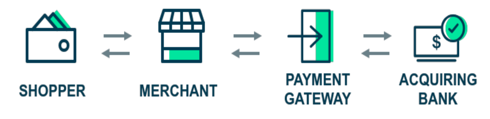
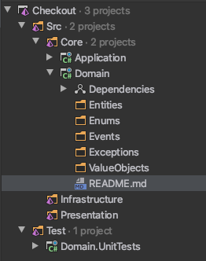

클린 아키텍쳐를 실무에서는 어떻게 구현하는지 알아보자. 아키텍쳐에 맞게 레이어를 구성할텐데 어떤 객체를 어떤 레이어에 정의하는지 이해하는데 초점을 맞추고자 한다. 예제로 다룰 시나리오는 인터넷 구매자의 결재처리를 온라인 상점을 대신해 처리해주는 Payment Gateway 이다.

<!--more-->

이전 글, [ASP.NET Core로 구현하는 클린 아키텍쳐 (1)](/클린아키텍쳐-1)에서 정리한 클린 아키텍쳐에 대한 개념을 확실히 잡고 이 글을 시작하기 바란다.

## Payment Gateway

PG의 클라이언트는 온라인 상점이다. 상점의 입장에서 고객 결재를 돕기 위해 API를 제공해야 한다. 상점과 은행의 중간에서 역할을 하기 때문에, PG는 은행의 Open API를 사용하는 클라이언트이기도 하다.



우리가 개발하고자 하는 기능은 PG의 핵심인 결재 기능이다. 상점의 결재 요청을 받아 고객의 은행과 중계하여 금액을 인출한다. 모든 요청을 저장하고 상점의 요청이 있을 때, 상세 내용을 알려줘야 한다.

## Clean Architecture + DDD (Domain-Driven Design)

DDD는 Evan Erics가 2004년에 동명의 책에 소개하여 유명해진 소프트웨어 설계 기법이다. 도메인 전문가와 끊임없는 협업을 통해 작은 도메인들을 중심으로 전체 소프트웨어가 유기적으로 구축되는 과정을 다룬다. DDD에서 사용하는 빌딩 블럭을 보면 `Entity`, `Value Object`, `Domain Event`, `Aggregate`, `Service`, `Repositories`, `Factories`등이 있는데 이중 일부를 클린 아키텍쳐에서 사용할 것이다.


클린 아키텍쳐의 다이어그램을 다시 보면서 솔루션내 프로젝트 구성을 생각해 보자. 가장 중심의 레이어에서는 `Enterprise Business Rules`를 구현하는데 그런 객체들을 `Entities`라고 하고, 애플리케이션에 특화된 비지니스 로직을 구현하는 것들을 `Use Cases`로 표현하고 있다.

`Entities`와 `Use Cases`라는 표현이 (나중에 프로젝트 명이 될) 레이어의 이름으로는 어딘가 부족하다. 엔티티의 집합, 유스케이스의 집합이라는 어감이 폴더명으로는 괜찮겠지만 레이어의 성격을 보여주기에는 부족하다. 오른쪽의 다이어그램과 같이 `Domain`, `Application` 레이어로 표현하는 것이 솔루션 구성에 좀더 적합해 보인다. 이 두개의 레이어는 솔루션의 코어 프로젝트가 될 것이다.

오른쪽 다이어그램에는 `Interface Adapters`에 대응하는 레이어가 없다. 레이어간의 경계를 넘는 객체를 매핑하는 레이어인데 `CQRS (Command Query Responsibility Segregation)`와 `DTO`를 사용하는 것으로 대치할 수 있기 때문이다.

그리고, 나머지는 크게 두 가지로 나뉘는데, 사용자(또는 클라이언트)와 인터페이스하는 `Presentation` 레이어, 그외 모든 것들을 `Infrastructure`로 생각할 수 있다.

이제 PG에 필요한 도메인 레이어를 구성해 보도록 하자.

## 도메인



도메인 레이어에는 DDD의 빌딩블럭인 `Entity`, `Value Object`, `Domain Event` 들이 `Enum`, `Exception`등과 함께 위치한다. 오른쪽 그림과 같이 솔루션을 구성했다.

Payment Gateway 솔루션의 이름을 `Checkout`으로 정했다. 크게 소스(`Src`)와 테스트(`Test`) 폴더로 나누고 소스 폴더는 다시 코어, 인프라스트럭쳐, 프레젠테이션으로 나누었다. 개발을 시작하기 위해 `Application`과 `Domain`이라는 이름으로 클래스 라이브러리 프로젝트를 코어 폴더에 추가하고, 도메인을 테스트하기 위한 xUnit 프로젝트를 테스트 폴더에 추가했다.

개발이 본격화되면 `Infrastructure` 폴더에는 `Persistence`, `DbMigration`, `IdentityProvider` 등의 프로젝트가 추가될 것이고, `Presentation` 폴더에는 `Api`, `Web` 등의 프로젝트가 폴더의 성격에 맞게 추가될 것이다.

#### Payment 엔티티

이 솔루션의 도메인이 무엇인지, 가장 먼저 필요한 요소가 무엇인지 생각해 보자. 결재 처리가 도메인의 핵심이라는 것을 어렵지 않게 떠올릴 수 있을 것이다. `Payment` 엔티티를 도메인에 추가하는 것으로 개발을 시작해 보자.

```csharp
public class Payment
{
    public Guid Id { get; private set; }
    public int MerchantId { get; private set; }
    public string CardHolderName { get; private set; }
    public string CardNumber { get; private set; }
    public string CardExpiryDate { get; private set; }
    public string Cvv { get; private set; }
    public decimal Amount { get; private set; }

    public Payment(int merchantId, string cardHolderName, string cardNumber,
      string cardExpiryDate, string cvv, decimal amount)
    {
        Id = Guid.NewGuid();
        MerchantId = merchantId;
        CardHolderName = cardHolderName;
        CardNumber = cardNumber;
        CardExpiryDate = cardExpiryDate;
        Cvv = cvv;
        Amount = amount;
    }
}
```

결재시 가장 필요한 속성들을 정의했다. 모든 속성은 private setter를 갖고 클래스 내부에서만 변경할 수 있다. DDD 스타일이라고 할 수 있는데, 이런 접근 방식때문에 파라미터가 많은 생성자가 필요하다. 개별 속성을 변경하는 것도 명시적으로 메서드를 통해야 한다. 예를 들어,`ChangeCardHolderName(string name)` 메서드를 통해서 카드 소지자의 이름을 변경해야 한다면, `CardHolderName` 속성이 실수로 변경되는 일을 막을 수 있을 것이다. DDD 스타일 엔티티는 다음과 같은 장점이 있다.

- 개별 속성을 실수로 변경할 수 없게 고유의 메서드를 제공한다. 한개의 속성당 한개의 업데이트 메서드를 의미하는 것이 아니다. `ChangeCardDetails(cardHolderName, cardNumber, expiryDate, cvv)`라는 메서드로 카드관련 속성들을 모두 업데이트할 수 있다.
- 객체 생성은 `Object Initializer` 문법 대신, 생성자를 사용한다. 객체를 생성하는 곳마다 반복될 만한 중복을 미연에 방지한다.
- 객체 초기화에 다소 복잡한 규칙이 있을때, 이를 숨길 수 있다. 예를 들어, 컬렉션 속성이 있다면 어떻게 초기화하고 관계를 만드는지 캡슐화한다.

엔티티의 속성을 직접 변경하는 코드에서는 그 변경의 의도를 알아채는 것이 쉽지않다. 메서드를 통한다면, 메서드명에서 그 의도를 유추할 수 있기 때문에 가독성이 좋아진다. 물론, 메서드명을 지을 때 데이터 보다는 처리 의도를 자세하게 표현하는 것이 좋다.

```csharp
UpdateCardHolder()  -->  AcceptCardHolderChangeRequest()
SetPaymentProcessedDate()  -->  ConfirmPayment()
```

모든 클래스에 DDD 스타일을 적용해야 하는 것은 아니다. 도메인 엔티티에는 가급적 추천하지만 DTO 같은 POCO에는 어울리지 않는다.

#### CardNumber

요구사항 중에, _`Payment` 엔티티를 저장하면서 카드번호도 함께 저장하는데 조회시에는 카드번호를 전부 보여주지 않는다(마스킹)_ 라는 요건이 있다면 어디에서 이 요건을 구현하는 것이 가장 좋을까?

이전에 `Value Object`를 사용하지 않았다면 아마도 `Payment` 클래스 내에서 해결하려고 했을 것이다. 카드번호를 마스킹하는 것은 엄밀하게 봐서 `Payment` 클래스의 관심사가 아니다. `Card Number` 를 Value Object로 정의하고 마스킹에 필요한 로직을 캡슐화한다.

```csharp
public class CardNumber : ValueObject
{
    public string OriginalValue { get; }

    public string MaskedValue
    {
        get
        {
            var rnd = new Random();
            var resultBuilder = new StringBuilder();
            var stringLength = OriginalValue.Length;

            var randomIndices = Enumerable.Range(0, stringLength)
                .OrderBy(x => rnd.Next())
                .Take(stringLength / 4)
                .ToList();

            for (var i = 0; i < stringLength; i++)
            {
                resultBuilder.Append(randomIndices.Contains(i) ? '*' : OriginalValue[i]);
            }

            const int chunkSize = 4;
            var masked = resultBuilder.ToString();

            var formatted = string.Join('-',
                Enumerable.Range(0, masked.Length / chunkSize)
                    .Select(i => masked.Substring(i * chunkSize, chunkSize)));

            return formatted;
        }
    }

    public CardNumber(string value)
    {
        OriginalValue = value;
    }

    public override string ToString()
    {
        return MaskedValue;
    }

    public static bool operator ==(CardNumber cardNumber1, CardNumber cardNumber2)
    {
        return EqualOperator(cardNumber1, cardNumber2);
    }

    public static bool operator !=(CardNumber cardNumber1, CardNumber cardNumber2)
    {
        return NotEqualOperator(cardNumber1, cardNumber2);
    }

    protected override IEnumerable<object> GetAtomicValues()
    {
        yield return OriginalValue;
    }
}
```

VO(Value Object는)는 엔티티와 더불어 도메인을 구성하는 중요한 요소다. 엔티티가 ID로 구별되는 대신 VO는 그 속성으로 구별된다. 이 구분이 항상 딱 떨어지는 것은 아니다. `Address`라는 객체가 ID에 의해 구분되어야 할지, 그 값에 의해 구분되어야 할지는 어떻게 그 객체를 사용하는 가에 달려있다. 주소의 변경 이력을 추적해야 한다면 ID로 구분해야 할 엔티티이고, 단순히 주소 정보만 저장한다면 VO로 취급하는 것이 관리하기 더 쉽다.

`CardNumber`는 그 값으로 구분되고 별도로 마스킹하는 로직이 필요하기(관심사의 분리) 때문에 VO 후보로 적합하다. `OriginalValue` 속성과 `MaskedValue` 속성을 따로 갖고 있어 상황에 맞게 사용하도록 구성했다. 값으로 비교해야 하는 원칙 때문에 비교를 위한 로직이 필요하고 그 것을 부모 클래스인 `ValueObject`에 구현한다. 모든 VO는 이 클래스를 상속한다. 이 밖에도 VO는 변경불가(immutable)하고 엔티티의 일부로만 존재할 수 있다.

VO는 관심사를 분리하는 가장 작은 단위라고 생각한다. 작은만큼 테스트를 쉽게 가져갈 수 있는데, 객체 하나만을 완벽하게 테스트할 수 있다는 점은 이 객체를 사용하는 다른 객체에서는 그 사용에 대해 걱정할 필요가 없다는 것을 의미한다. 따라서, 모킹(mocking)의 부담도 줄고 유닛테스트도 쉽게 작성할 수 있다. 아래 테스트는 크지 않으면서 `CardNumber` VO를 100% 커버한다.

```csharp
public class CardNumberTests
{
    private const string CardNumber = "1111222233334444";
    private readonly CardNumber sut;

    public CardNumberTests()
    {
        sut = new CardNumber(CardNumber);
    }

    [Fact]
    public void CardNumber_WhenConvertedToString_ShouldNotBeOriginalValue()
    {
        var converted = $"{sut}";

        converted.Should().NotBe(CardNumber);
    }

    [Fact]
    public void CardNumberMaskedValue_ShouldNotBeOriginalValue()
    {
        sut.MaskedValue.Should().NotBe(CardNumber);
    }

    [Fact]
    public void CardNumberMaskedValue_ShouldMaskFourDigits()
    {
        sut.MaskedValue.Count(chr => chr == '*').Should().Be(4);
    }

    [Fact]
    public void CardNumberMaskedValue_ShouldBeFormatted()
    {
        const int chunkSize = 5;
        var chars = Enumerable.Range(1, 3)
            .Select(i =>
                sut.MaskedValue.Substring(i * chunkSize - 1, 1));

        chars.All(chr => chr == "-").Should().BeTrue();
    }

    [Fact]
    public void CardNumber_TwoInstancesWithTheSameCardNumber_ShouldEqual()
    {
        var secondCardNumber = new CardNumber(CardNumber);

        sut.Equals(secondCardNumber).Should().BeTrue();
    }

    [Fact]
    public void CardNumber_TwoInstancesWithTheSameCardNumber_ShouldEqualOnOperator()
    {
        var secondCardNumber = new CardNumber(CardNumber);

        (sut == secondCardNumber).Should().BeTrue();
    }

    [Fact]
    public void CardNumber_TwoInstancesWithDifferentCardNumber_ShouldNotEqualOnOperator()
    {
        var secondCardNumber = new CardNumber("4444333322221111");

        (sut != secondCardNumber).Should().BeTrue();
    }
}
```

문자열이었던 `CardNumber`를 VO로 리팩토링했기 때문에 `Payment` 클래스도 다음과 같이 수정한다.

```csharp
public class Payment
{
    // ...
    public string CardExpiryDate { get; private set; }
    public CardNumber CardNumber { get; private set; }
    // ...

    public Payment(int merchantId, string cardHolderName, string cardNumber,
      string cardExpiryDate, string cvv, decimal amount)
    {
      // ...
        CardNumber = new CardNumber(cardNumber);
      // ...
    }
}
```

## Value Object

또 하나의 VO 후보로 `CardExpiryDate`가 있다. `MM/YY` 포맷으로 표현하지만 유효성 검사를 위해서는 날짜 타입으로 변경해야 한다. 또한, 년도를 두자리만 받아도 네자리 년도로 변경할 수 있어야 한다. 구현은 다르지만 이미 VO를 봤기 때문에 여기서는 생략한다. 대신, [GitHub Repository](https://github.com/JakeRyu/Checkout/tree/issue%231/payment-entity/Src/Core/Domain)에서 구현된 코드를 확인할 수 있다.

만약에 여러 나라의 통화를 고려해야 한다면, `Amount` 속성 또한, VO 후보이다. `Amount`, `Currency` 속성을 포함하는 `Money`라는 객체로 캡슐화할 수 있다.

VO를 쓰기 시작하면 모든 속성에 대해 다시 고민하게 될 것이다. 누구는 모든 엔티티를 VO 에서부터 생각하는 습관이 필요하다고도 한다. VO에서 시작해서 필요하다면 엔티티로 변경하는 것도 좋은 접근법이다. 그 정도로 DDD에서는 Value Object를 중요하게 생각한다.

VO가 관심사를 분리하여 비즈니스 룰을 캡슐화하는 좋은 도구지만 단점도 있다. 엔티티에 포함되어 그것과 생명주기를 같이 한다는 것이다. 예를 들어, `Adderess` 라는 VO 만으로는 그 의미를 부여할 수 없다. 고객의 주소든, 배송의 배달지든 `Address` 객체를 품는 엔티티가 존재해야 한다. 이때, 엔티티프레임워크 같은 ORM을 통해 엔티티를 저장하려면, VO에 대한 특별한 매핑이 필요하다. 다행히도, EntityFramework Core 에서는 VO를 지원하기 위해 `Owned Type`이 추가되었다. [Microsoft 공식문서](https://docs.microsoft.com/en-us/dotnet/architecture/microservices/microservice-ddd-cqrs-patterns/implement-value-objects)에서 자세한 내용을 찾아볼 수 있다.

## 중간정리

이번 글에서는 솔루션을 클린 아키텍쳐에 기반해서 구성하고 도메인 프로젝트를 시작했다. 도메인에서 가장 중요한 요소라고 할 수 있는 엔티티와 `Value Object`를 추가하고 DDD 관점에서 보는 장점을 정리했다.

이 편에 해당하는 소스만 별도의 Git 브랜치로 묵었으니 [해당 브랜치](https://github.com/JakeRyu/Checkout/tree/issue%231/payment-entity/Src/Core/Domain)를 선택하면 이 글에서만 사용된 소스를 확인할 수 있다. 이해가 어려운 부분이 있다면 소스 리포지토리를 클론한 후, 테스트 프로젝트를 디버깅 모드로 실행하면서 코드를 분석해 보는 것이 도움이 될 것이다.

다음 편에서는 애플리케이션 레이어에서 유스케이스를 구현하면서 도메인 객체를 사용하는 것에 대해 알아보겠다.

#### 예제 소스
[https://github.com/JakeRyu/Checkout](https://github.com/JakeRyu/Checkout)
