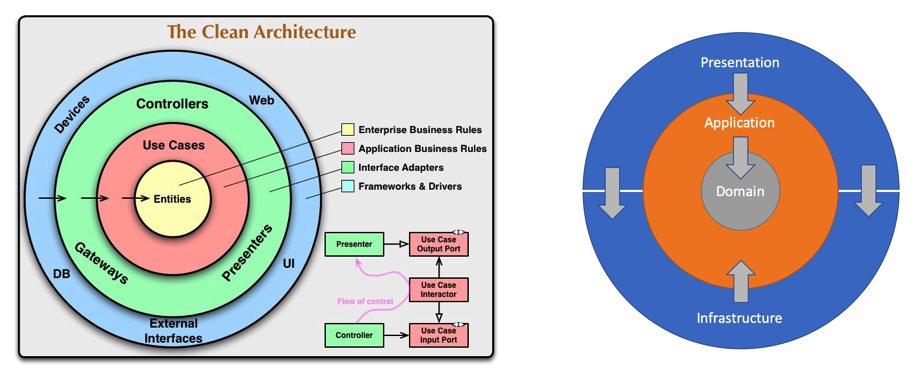
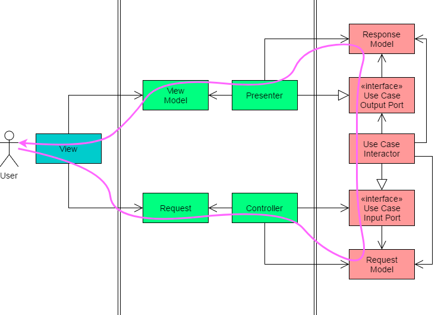

지난편에 이어서 애플리케이션 레이어를 완성할 것이다. 조회 요청을 다루면서 DTO(Data Transfer Object)를 효율적으로 정의하고 매핑을 자동화하는 방법을 알아본다. 몇 가지 예외를 정의하고 다른 레이어에서 적절히 사용할 수 있도록 한다.

<!--more-->

> - [ASP.NET Core로 구현하는 클린 아키텍쳐 (1)](/클린아키텍쳐-1)
> - [ASP.NET Core로 구현하는 클린 아키텍쳐 (2)](/클린아키텍쳐-2)
> - [ASP.NET Core로 구현하는 클린 아키텍쳐 (3)](/클린아키텍쳐-3)

## 유스케이스 구현

전편에서는 결재 요청에 대한 정보를 저장하는 유스케이스를 **커맨드**로 구현했으니 이번에는 그 내용을 조회하는 **쿼리** 객체를 구상해보자.

#### (유스케이스 #2) 단일 결재 조회하기

먼저, 유닛테스트를 통해 쿼리 객체를 어떻게 사용하게 될지, 반환값을 어떻게 정의할지 구성해본다.

```csharp
[Fact]
public async Task Handler_GivenExistingId_ShouldReturnAPaymentRecord()
{
    var payment = new Payment(1, "cardholder1", "1111-2222-3333-4444", "12/22", "111", 1000);
    
    await context.Payments.AddAsync(payment);
    await context.CommitAsync(CancellationToken.None);
    
    var query = new GetPaymentDetailQuery
    {
        Id = payment.Id
    };
    var sut = new GetPaymentDetailQuery.Handler(context, mapper);

    var result = await sut.Handle(query, CancellationToken.None);
    result.Should().BeOfType<PaymentDetailDto>();
    result.CardHolderName.Should().Be("cardholder1");
}
```

쿼리 객체의 이름은 `GetPaymentDetailQuery` 처럼 쿼리로 끝난다. 대부분의 엔티티 조회가 그렇듯 ID를 조회조건으로 사용한다. 쿼리의 반환값으로 `Payment` 엔티티가 아닌 DTO(`PaymentDetailDto`)를 정의했다. 

```csharp
public class PaymentDetailDto
{
    public Guid Id { get; set; }
    public string CardHolderName { get; set; }
    public string MaskedCardNumber { get; set; }
    public decimal Amount { get; set; }
}
```

`Payment` 엔티티는 7개의 속성이 있지만 `PaymentDetailDto`를 사용하여 꼭 필요한 4개의 속성만 노출하고 있다. 또한, 마스킹된 카드번호를 반환하기 때문에 DTO가 꼭 필요한 경우라고 할 수 있다. 여기서 잠깐 아키텍쳐 내에서 DTO의 역할을 짚고 넘어가자.

#### Interface Adapters 레이어

클린 아키텍쳐 관점에서 다시 생각해보면, 레이어의 경계에서 달라지는 데이터 모델을 관리하기 위해 Interface Adapters라는 별도 레이어를 애플리케이션 레이어 밖에 위치시켰다. 



Interface Adapters에 위치하고 있는 `Controller`와 `Presenter`가 어떤 역할을 하는지 아래 그림을 통해 자세히 알아보자.



- 사용자는 View를 통해 애플리케이션을 사용하고 있다. 요청하고 응답을 받는 창이다.
- 뷰에서 요청을 만들고 컨트롤러가 이를 받는다.
- 컨트롤러는 이 요청을 애플리케이션이 이해할 수 있는 모델 즉, input port로 정의한 형식으로 변환한다. 그리고, Usecase Interactor로 넘긴다.
- Usecase Interactor는 요청을 처리하여 output port에 정의된 형식으로 결과를 작성한다.
- 프레젠터는 이 결과치를 view model로 변환하여 사용자가 보고 있는 뷰에 전달한다.

이렇게까지 복잡한 형변환이 왜 필요한걸까?

레이어의 경계에서 모든 화살표는 왼쪽에서 오른쪽으로 향한다. 즉, 종속성의 방향이 일관되게 바깥에서 안쪽으로 향하고 있다는 의미다. 이쯤되면 클린 아키텍쳐는 종속성의 흐름(방향)에 대해 아주 엄격한 걸 넘어서 강박적이라고도 할만하다.

이 레이어에서 일어나는 형변환을 좀더 쉽게 처리하기 위해 컨트롤러 대신 커맨드 & 쿼리로 요청을 캡슐화했다. 그리고, 프레젠터의 역할을 DTO로 대신하고 있는 것이다.

DTO는 모델 정의에 있어 도메인 엔티티와 상당히 유사하다. 혹시라도, 귀찮다는 이유로 엔티티를 직접 노출한다면 외부적인 요인때문에 엔티티를 변경해야 하는 상황에 직면할 수 있다. 그래서, DTO와 엔티티의 구조가 일치하더라도 DTO를 사용하는 것이 장기적인 유지보수 관점에서 필요하다고 할 수 있다. 

그러나, DTO를 정의하고 사용하는 것은 사실 꽤 귀찮은 일이다. AutoMapper를 사용해서 이 문제를 해결해 보자.

#### AutoMapper

[AutoMapper](https://docs.automapper.org/en/latest/Getting-started.html)는 객체와 객체를 규칙에 의해 매핑해주는 툴이다. 예를 들어, 소스와 타겟 객체의 속성을 똑같은 이름으로 정해주면 (네이밍 컨벤션에 따라) 최소한의 노력으로 매핑이 완성된다.

최소한의 노력이란 `CreateMap()` 메서드를 사용하여 AutoMapper의 프로필에 소스와 타겟 객체간의 연관성을 등록해야 하는 일이다. 이 과정을 자동화 시켜보자.

`DtoBase`라는 추상 클래스를 정의하면서 제네릭 인자로 엔티티 타입을 기대한다. 또한, `Mapping`이라는 메서드를 `virtual`로 정의하여 자식 클래스에서 오버라이드할 수 있도록 한다. 자식클래스에서 오버라이드하지 않을 경우에는 AutoMapper 프로필에 가장 단순한 매핑을 추가하게 된다.

```csharp
public abstract class DtoBase<T>
{
    public virtual void Mapping(Profile profile) => profile.CreateMap(typeof(T), GetType());
}
```

`T` 라는 제네릭 인자는 엔티티 타입이므로 `CreateMap(source, target)` 메서드에서 소스에 위치하고 `DtoBase`의 자식 클래스가 타켓이 된다. 별도의 명시적인 매핑이 필요 없다면 이 방식을 통해 간단하게 매핑을 마칠 수 있다.

다음 코드는 `Payment` 엔티티를 `PaymentDetailDto`로 매핑하는 과정이다. 특별한 경우, 추가적인 매핑이 필요할때만 `Mapping` 메서드를 오버라이드하는데 이 경우가 그 예라고 할 수 있다. 엔티티에서 `CardNumber`라는 Value Object의 `MaskedValue` 속성을 DTO의 `MaskedCardNumber` 속성에 매핑한다. 네이밍 컨벤션에 의해 처리할 수 없기 때문이다.

```csharp
public class PaymentDetailDto : DtoBase<Payment>
{
    public Guid Id { get; set; }
    public string CardHolderName { get; set; }
    public string MaskedCardNumber { get; set; }
    public decimal Amount { get; set; }

    public override void Mapping(Profile profile)
    {
        profile.CreateMap<Payment, PaymentDetailDto>()
            .ForMember(d => d.MaskedCardNumber, opt => 
                opt.MapFrom(src => src.CardNumber.MaskedValue));
    }
}
```

마지막으로, `DtoBase`를 상속하는 모든 클래스를 자동으로 등록하려고 한다. 아래 코드는 AutoMapper 문서가 제안하는 가장 깔끔한 프로필 관리 방식이다. Profile 클래스를 상속한 후, 생성자에서 필요한 매핑을 하는 것이, 다시말해 `CreateMap()` 메서드를 사용하는 것이 일반적으로 매핑을 등록하는 방식이다.

이렇게 Profile을 상속해서 별도의 파일에서 매핑을 다루면, 매핑이 필요한 수만큼의 새로운 클래스가 발생할 것이다. 여기서는 단하나의 대표 프로필, `MappingProfile`을 사용해서 어셈블리에 있는 모든 DTO 클래스를 자동으로 등록하려고 한다.

```csharp
public class MappingProfile : Profile
{
    public MappingProfile()
    {
        ApplyMappingsFromAssembly(Assembly.GetExecutingAssembly());
    }

    private void ApplyMappingsFromAssembly(Assembly assembly)
    {
        var types = assembly.GetExportedTypes()
            .Where(t => 
                t.BaseType != null && t.BaseType.Name.Contains("DtoBase"))
            .ToList();

        foreach (var type in types)
        {
            var instance = Activator.CreateInstance(type);
            var methodInfo = type.GetMethod("Mapping");
            methodInfo?.Invoke(instance, new object[] {this});
        }
    }
}
```

`ApplyMappingsFromAssembly()` 메서드는 DtoBase를 상속하는 모든 자식 클래스를 찾아서 `Mapping()` 메서드를 실행한다. 그 결과로, 각각의 매핑이 생성되고 등록된다. 

애플리케이션에서는 매핑관련 구체적인 정보를 스스로 구성하고 있지만 이 정보를 등록하는 일은 외부에서 벌어진다. 테스트 프로젝트에서 매핑 정보를 어떻게 등록하고 사용하는지 살펴보자.

```csharp
[Collection("QueryCollection")]
public class GetPaymentDetailQueryTests
{
    private readonly CheckoutDbContext context;
    private readonly IMapper mapper;

    public GetPaymentDetailQueryTests(QueryTestFixture fixture)
    {
        context = fixture.Context;
        mapper = fixture.Mapper;
    }

    [Fact]
    public async Task Handler_GivenExistingId_ShouldReturnAPaymentRecord()
    {
        var payment = new Payment(1, "cardholder1", "1111-2222-3333-4444", "12/22", "111", 1000);
        
        await context.Payments.AddAsync(payment);
        await context.CommitAsync(CancellationToken.None);
        
        var query = new GetPaymentDetailQuery
        {
            Id = payment.Id
        };
        var sut = new GetPaymentDetailQuery.Handler(context, mapper);

        var result = await sut.Handle(query, CancellationToken.None);
        result.Should().BeOfType<PaymentDetailDto>();
        result.CardHolderName.Should().Be("cardholder1");
    }
}
```

테스트 대상(sut)를 정의하는 곳에서 GetPaymentDetailQuery.Handler를 생성하기 위해 mapper가 필요하다. 이 것은 생성자에 전달된 TestFixture를 통해 초기화하고 있다. TestFixture는 xUnit 테스트에서 여러 클래스에서 정보를 공유하기 위한 기법인데 다음과 같이 정의하여 사용한다.

```csharp
public class QueryTestFixture : IDisposable
{
    public CheckoutDbContext Context { get; private set; }
    public IMapper Mapper { get; private set; }

    public QueryTestFixture()
    {
        Context = CheckoutDbContextFactory.Create();

        var configurationProvider = new MapperConfiguration(cfg =>
        {
            cfg.AddProfile<MappingProfile>();
        });

        Mapper = configurationProvider.CreateMapper();
    }

    public void Dispose()
    {
        CheckoutDbContextFactory.Destroy(Context);
    }
}

[CollectionDefinition("QueryCollection")]
public class QueryCollection : ICollectionFixture<QueryTestFixture> { }
```

데이터베이스 컨텍스트와 함께 매퍼도 생성하고 있는데, 앞서 정의한 MappingProfile 하나만을 추가하지만 그것이 어떤 영향을 끼치는지 상기해보자.

쿼리 객체를 구현하기에 앞서 사설이 길었다. 완성된 코드는 아래와 같다. 예상대로 간단 명료하다.

```csharp
public class GetPaymentDetailQuery : IRequest<PaymentDetailDto>
{
    public Guid Id { get; set; }

    public class Handler : IRequestHandler<GetPaymentDetailQuery, PaymentDetailDto>
    {
        private readonly ICheckoutDbContext context;
        private readonly IMapper mapper;

        public Handler(ICheckoutDbContext context, IMapper mapper)
        {
            this.context = context;
            this.mapper = mapper;
        }

        public async Task<PaymentDetailDto> Handle(GetPaymentDetailQuery request,
            CancellationToken cancellationToken)
        {
            var payment = await context.Payments
                .SingleOrDefaultAsync(p => p.Id == request.Id, cancellationToken: cancellationToken);

            if (payment == null)
            {
                throw new EntityNotFoundException(nameof(Payment), request.Id);
            }

            return mapper.Map<PaymentDetailDto>(payment);
        }
    }
}
```

- 쿼리 조건으로는 `Id`만 정의하고 있다. 
- 핸들러를 사용하기 위해 데이터베이스 컨텍스트와 매퍼가 필요하다. 
- 핸들러는 데이터베이스 컨텍스트로 Payment 엔티티를 조회하고 그 결과를 매퍼를 사용하여 DTO로 반한한다. 
- 매핑 정보가 제대로 등록되지 않았다면 이 부분에서 에러가 발생할 것이다.

## 예외 처리

앞선 코드에서 조회 결과가 없으면 어떤 피드백이 있어야 한다. 애플리케이션 레이어에서는 예외를 체계적으로 정의해서 발생시키는 것으로 그 의무를 다하고, 그 예외를 잡아서 사용자에게 안내하는 일은 프레젠테이션 레이어에 존재하는 프로젝트들의 몫이다. 예외는 원하는 만큼 정의할 수 있지만 HTTP Status와 연관해서 생각하는 것이 좋다.

```csharp
public class EntityNotFoundException : Exception
{
    public EntityNotFoundException(string name, object key)
        : base($"Entity \"{name}\" ({key}) was not found.")
    {
    }
}
```

위의 예외는 해당 엔티티를 찾을 수 없는 경우, 찾으려는 엔티티의 종류와 조회에 사용된 키값을 메시지에 포함하여 찾기에 실패했음을 알리는데 사용한다. 이 쿼리가 Web API에서 사용된다면 404 Not Found 에 딱 맞는 예외다.

비슷한 예로, ValidationException을 애플리케이션에서 발생시키면 API 단에서는 400 Bad Request로 변환할 수 있겠다. 이 부분은 API 프로젝트를 구현할 때, 자세히 설명하도록 하겠다.


## (유스케이스 #3) 결재 목록 조회하기

이번에는 목록 조회를 통해 추가로 몇가지를 살펴보고자 한다.

```csharp
public class GetPaymentsListQuery : IRequest<PaymentsListVm>
{
    public int MerchantId { get; set; }
    public string CardNumber { get; set; }

    public class Handler : IRequestHandler<GetPaymentsListQuery, PaymentsListVm>
    {
        private readonly ICheckoutDbContext context;
        private readonly IMapper mapper;

        public Handler(ICheckoutDbContext context, IMapper mapper)
        {
            this.context = context;
            this.mapper = mapper;
        }
        
        public async Task<PaymentsListVm> Handle(GetPaymentsListQuery request, CancellationToken cancellationToken)
        {
            var payments = await context.Payments
                .AsNoTracking()
                .Where(p => p.MerchantId == request.MerchantId &&
                    p.CardNumber.OriginalValue == request.CardNumber)
                .ProjectTo<PaymentDetailDto>(mapper.ConfigurationProvider)
                .ToListAsync(cancellationToken);
            
            return new PaymentsListVm
            {
                Payments = payments
            };
        }
    }
}
```

`Handle()` 메서드에서 목록을 조회하면서 `ProjectTo<PaymentDetailDto>()`를 사용했다. AutoMapper가 제공하는 `IQueryable` 인터페이스의 확장인데 LINQ 문장에서 유용하게 사용할 수 있다. 

DTO 객체가 집합으로 반환되는 경우에, `IEnumerable<PaymentDetailDto>` 형식으로 반환하는 것도 충분히 가능한 일이다. 그러나, 응답 모델에 다른 속성을 추가해야 할 상황이 생기면 이 모델은 유연하지 않다. 그래서 `PaymentsListVm` 라는 새로운 뷰 모델을 사용했다.

```csharp
public class PaymentsListVm
{
    public IList<PaymentDetailDto> Payments { get; set; }
}
```

속성을 추가하기에 훨씬 편한 구조임을 알 수 있다. DTO를 감싸는 형태라서 또 다른 DTO를 사용하는 것보다 뷰 모델이라는 새로운 개념을 적용했다.

#### [현재까지 구현된 전체 코드](https://github.com/JakeRyu/Checkout/tree/issue%235/query-payment)

## 중간정리

이번 글에서는 애플리케이션 레이어에서 Interface Adapters 레이어를 흡수, 구현하는 방법을 CQRS + DTO 조합으로 알아보았다. 특히, AutoMapper를 사용할 때, 매핑을 자동화하는 방법에 많은 지면을 할애했다. 마지막으로, 예외를 어떻게 정의하는지, 추후 다른 레이어에서 그 예외를 어떻게 사용할지, 그 가능성에 대해 언급했다.

애플리케이션 레이어 관련한 두 편의 글에서 아래 내용을 다루었다. 이 것으로 애플리케이션 레이어의 역할을 이해하는데 도움이 되었기를 바란다.

- 인터페이스 정의
- 유스케이스 구현
- 커맨드 & 쿼리 (CQRS)
- 유효성 검사
- 예외 정의

다음 편에서는 미처 담지 못한 보너스를 소개하면서 애플리케이션 레이어의 완성도를 높여보고자 한다. MediatR의 고급 기능을 통해, 유효성 검사를 자동화하고 애플리케이션의 성능을 로깅하는 법에 대해 알아볼 것이다.
